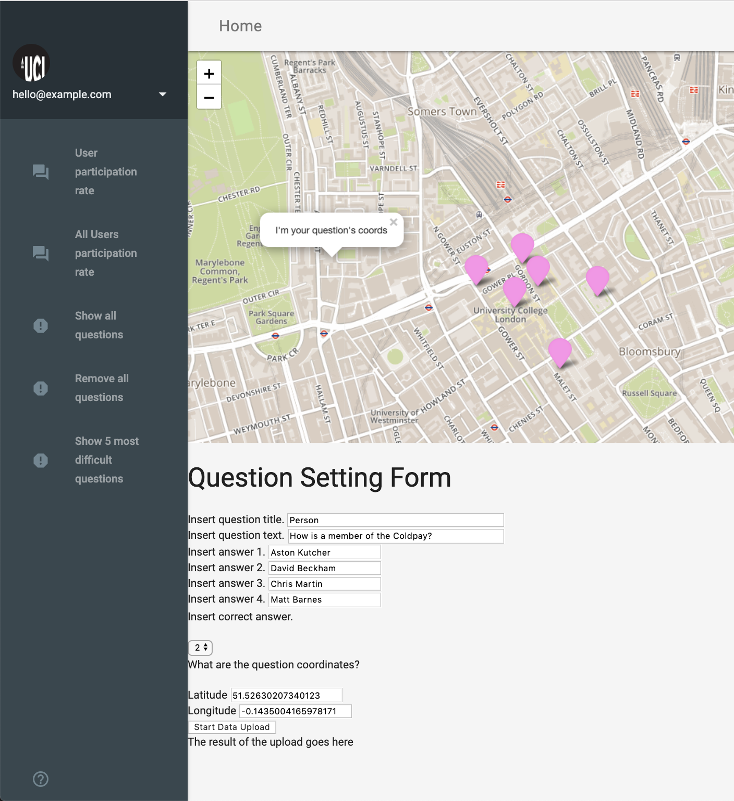

## Questions
2.Question app
==============

The Question app is a location-based app that runs on a web browser
using Material design. 
When the app is launched it loads a series of questions points that were
previously inserted by the user into the database. Questions points can
be inserted from by clicking on the map and filling in the Question
Setting Form.

System requirements
-------------------

The Quiz app supports the following browsers: Version 73.0.3683.86
(Official Build) (64-bit) and Version 12.0.1 (14606.2.104.1.1).

### How to deploy the code?

To deploy this code, first download an SSH file transfer software such
as BitVise(1)(**Figure 1**) for Windows or Cyberduck(2) for
Mac. Set up the SSH software so as connect to the Ubuntu Server by
inserting a port number and host. For the authentication provide a
username and password. Once the SSH software is connected to SFTP
client, navigate to the local server using the following command *cd
/home/username*(3)*/code.* Use the Linux (Ubuntu ) terminal from
the SSH software to clone the GitHub repositories
(ucesapc-question(7) and ucesapc-serve(5)) to the local server
using the command line (*git clone HTTPS URL*(6)). Start the server
from the cloned ucesapc-server repository by navigating to *cd
/home/username*(3)*/code/ucesapc-server.* Run the following command
*node httpServer.js* to debug the server then *pm2 start httpServer.js*
and *pm2 start httpsServer.js* to start the server. In order to deploy
the quiz app on an Android device, navigate to the ucesapc-question
folder cloned in the local server using the following command line (*cd
/home/username*(3)*/code/ucesapc-quiz/ucesapc/*). Using the Linux
(Ubuntu) terminal from the SSH software run the code "*phonegap serve"*
in the command line. From the smartphone device, launch the browser and
type the server address in the Url field.

### How to test the code?

Testing the code requires opening the browser and typing the URL of the
server host followed by a port ID (if necessary). The launched app
should have an interface as shown in (**Figure 3)**. When filling in the
form and pressing the start data upload button and a message "row
inserted" show display at the bottom of the page confirm that the
questions were added to the database. Note, tests can only be carried
out with the server (e.g. httpServe.js) running.

**Figure 3:** Question App interface in the browser, before

| Files                      | Function                                                                                                                         |
|----------------------------|----------------------------------------------------------------------------------------------------------------------------------|
| Index.html                 | Contains the code for the web client side (e.g. material design and leaflet functions). The main function is to display the app. |
| Instructions.html          | Contains user guide instruction to inform and guide new users.                                                                   |
| leaflet.awesome-markers.js | Provides styling for the leaflet features such as markers.                                                                       |
| leaflet.js                 | Provides mp tile to the application (e.g. mapbox and open street map)                                                            |
| leafletFunctions.js        | Makes all the the request to the database (e.g. get the form data )                                                              |
| startup.js                 | Responsible for initiating any desired function when the app is launched (e.g. load the quiz points)                             |
| uploadData.js              | Responsible for uploading the quiz pointsto the database                                                                         |
| utilities.js               | Processes port number from the port.xml file and lots form data (i.e. quiz points)                                               |

**Table 2:** Illustrates all HTML and javascript files deployed in the
Quiz App.
