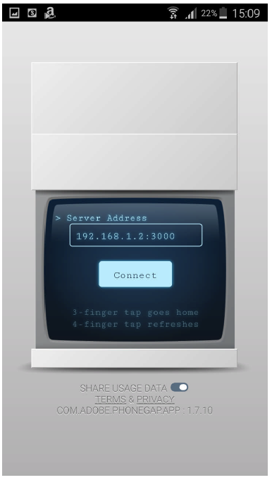
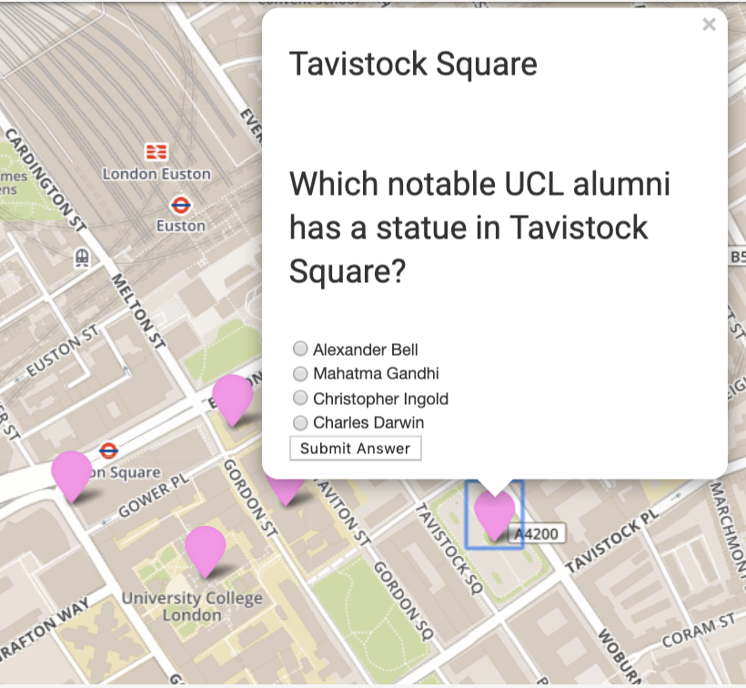

# quiz
Technical Guide 
================

1.Quiz app
==========

The Quiz app is a location-based app that runs on Android phones using
PhoneGap and Material design. When the app is launched it loads a series
of quiz questions and receives the user's location. Once a quiz point is
within the user's radio, a pop-up in the point opens prompting the user
to answer the question. The questions within the app relate to a wide
variety of historical and landmark topics.

System requirements
-------------------

The Quiz app supports Android model above 2.3.3 Gingerbread (API Level
10). The app was executed on the Cordova PhoneGap.

### How to deploy the code?

To deploy this code, first download and SSH file transfer software such
as BitVise (1) for Windows or Cyberduck (2) for Mac. Set up the
SSH to connect to the Ubuntu Server by inserting a port number and host.
For the authentication provide a username and password (**Figure 1**).
Once the SSH software is connected to SFTP client, navigate to the local
server using the following command *cd /home/username*(3)$*/code.*
Use the Linux (ubuntu) terminal from the SSH software to clone the
github repositories (ucesapc-quiz(4) and ucesapc-serve(5)) to
the local server using the command line (*git clone HTTPS URL*(6)).
Start the server from the cloned ucesapc-server repository by navigating
to *cd /home/username*(3)*/code/ucesapc-server.* Run the following
command *node httpServer.js* to debug the server then *pm2 start
httpServer.js* and *pm2 start httpsServer.js* to start the server. In
order to deploy the quiz app on an Android device, navigate to the
ucesapc-quiz folder cloned in the local server using the following
command line (*cd /home/username*(3)*/code/ucesapc-quiz/ucesapc/*).
Using the Linux (Ubuntu) terminal from the SSH software run the code
"*phonegap serve"* in the command line. From the smartphone device,
launch the PhoneGap app and type the server address in the empty field
and connect.

**Figure 1:** Show a BitVise interface, to access the server and virtual
machine. (Taken from: Ellul, 2019.)

### How to test the code?

Testing the code can be done by downloading the PhoneGap by logging in
the server (**Figure 2).** For a perfect functioning app the outcome
once the question is answered should display, a red marker for the wrong
answers, a green marker for the correct answers and a pink marker for a
yet to be answered question (**Figure 2**). Note, tests can only be
carried out with the server (e.g. httpServe.js) running.

**Figure 2:** Shows the process of initiating the Quip App on PhoneGap
(left) to the testing of the app (right).

| Files                      | Function                                                                                                                         |
|----------------------------|----------------------------------------------------------------------------------------------------------------------------------|
| Index.html                 | Contains the code for the web client side (e.g. material design and leaflet functions). The main function is to display the app. |
| Instructions.html          | Contains user guide instruction to inform and guide new users.                                                                   |
| leaflet.awesome-markers.js | Provides styling for the leaflet features such as markers.                                                                       |
| leaflet.js                 | Provides mp tile to the application (e.g. mapbox and open street map)                                                            |
| leafletFunctions.js        | Makes all the the request to the database (e.g. get the form data )                                                              |
| startup.js                 | Responsible for initiating any desired function when the app is launched (e.g. load the quiz points and tracks user position)    |
| uploadData.js              | Responsible for uploading the quiz answers,to the database                                                                       |
| userTracking.js            | Provides users current position and all location-based function.                                                                 |
| utilities.js               | Processes port number from the port.xml file and lots form data (i.e. quiz points)                                               |

**Table 1:** Illustrates all HTML and javascript files deployed in the Quiz App.

2.Question app
==============

The Question app is a location-based app that runs on a web browser
using Material design. 
When the app is launched it loads a series of questions points that were
previously inserted by the user into the database. Questions points can
be inserted from by clicking on the map and filling in the Question
Setting Form.

System requirements
-------------------

The Quiz app supports the following browsers: Version 73.0.3683.86
(Official Build) (64-bit) and Version 12.0.1 (14606.2.104.1.1).

### How to deploy the code?

To deploy this code, first download an SSH file transfer software such
as BitVise(1)(**Figure 1**) for Windows or Cyberduck(2) for
Mac. Set up the SSH software so as connect to the Ubuntu Server by
inserting a port number and host. For the authentication provide a
username and password. Once the SSH software is connected to SFTP
client, navigate to the local server using the following command *cd
/home/username*(3)*/code.* Use the Linux (Ubuntu ) terminal from
the SSH software to clone the GitHub repositories
(ucesapc-question(7) and ucesapc-serve(5)) to the local server
using the command line (*git clone HTTPS URL*(6)). Start the server
from the cloned ucesapc-server repository by navigating to *cd
/home/username*(3)*/code/ucesapc-server.* Run the following command
*node httpServer.js* to debug the server then *pm2 start httpServer.js*
and *pm2 start httpsServer.js* to start the server. In order to deploy
the quiz app on an Android device, navigate to the ucesapc-question
folder cloned in the local server using the following command line (*cd
/home/username*(3)*/code/ucesapc-quiz/ucesapc/*). Using the Linux
(Ubuntu) terminal from the SSH software run the code "*phonegap serve"*
in the command line. From the smartphone device, launch the browser and
type the server address in the Url field.

### How to test the code?

Testing the code requires opening the browser and typing the URL of the
server host followed by a port ID (if necessary). The launched app
should have an interface as shown in (**Figure 3)**. When filling in the
form and pressing the start data upload button and a message "row
inserted" show display at the bottom of the page confirm that the
questions were added to the database. Note, tests can only be carried
out with the server (e.g. httpServe.js) running.

**Figure 3:** Question App interface in the browser, before

| Files                      | Function                                                                                                                         |
|----------------------------|----------------------------------------------------------------------------------------------------------------------------------|
| Index.html                 | Contains the code for the web client side (e.g. material design and leaflet functions). The main function is to display the app. |
| Instructions.html          | Contains user guide instruction to inform and guide new users.                                                                   |
| leaflet.awesome-markers.js | Provides styling for the leaflet features such as markers.                                                                       |
| leaflet.js                 | Provides mp tile to the application (e.g. mapbox and open street map)                                                            |
| leafletFunctions.js        | Makes all the the request to the database (e.g. get the form data )                                                              |
| startup.js                 | Responsible for initiating any desired function when the app is launched (e.g. load the quiz points)                             |
| uploadData.js              | Responsible for uploading the quiz pointsto the database                                                                         |
| utilities.js               | Processes port number from the port.xml file and lots form data (i.e. quiz points)                                               |

**Table 2:** Illustrates all HTML and javascript files deployed in the
Quiz App.

3.Server
========

System requirements
-------------------

The server supports Ubuntu 14.04/15.10, CentOS 6.x, Red Hat Enterprise
Linux (RHEL) 7.x and Debian 7.7.

### How to deploy the code?

The server is deployed using NodeJS run-time environment (**Table 3**).

### How to test the code?

To test the code the server has to run in debug mode so that any errors
can be seen in the console. This is done by first navigation to the
folder directory containing the *httpServer.js* stopping the server
typing the command line (pm2 stop *server\_number*) in the Ubuntu
terminal. Then type the following command line in the Ubuntu terminal:
*node httpServer.js.* To test the code. If no error is shown in the
console log, then the code is running perfectly, otherwise, an error
message will be displayed.

| Files          | Function                                                                                                        |
|----------------|-----------------------------------------------------------------------------------------------------------------|
| httpServer.js  | Contains SQL queries to perform operations through HTTP protocol between the client and the database side.      |
| httpsServer.js | Contains SQL queries to perform operations through the,HTTPS protocol between the client and the database side. |

**Table 3:** illustrates all javascript files deployed in the Server.

4.References
==============

Ellul, Claire, 2019. Web and Mobile GIS: Lecture slides from module Web
and Mobile GIS - Apps and programming. MSc Geospatial Sciences,
University College London, London, UK

*1. https://www.bitvise.com/sshclient-download*

*2. https://cyberduck.io/download/*

*3. Username: refers to username insert in the authentication field in
the SSH software.*

*4. <https://github.com/ucl-geospatial/ucesapc-quiz>*

*5.
[https://github.com/ucl-geospatial/ucesapc-server](https://github.com/ucl-geospatial/ucesapc-quiz)*

*6. HTTPS URL: refers to URL link to the repository on Github.*

*7.
[https://github.com/ucl-geospatial/ucesapc-qu](https://github.com/ucl-geospatial/ucesapc-quiz)estion*

5.Appendix
==============

Code modified from Ellul, 2019 practicals for the Web and Mobile GIS App
course at UCL as part of the MSc Geospatial Science program.
