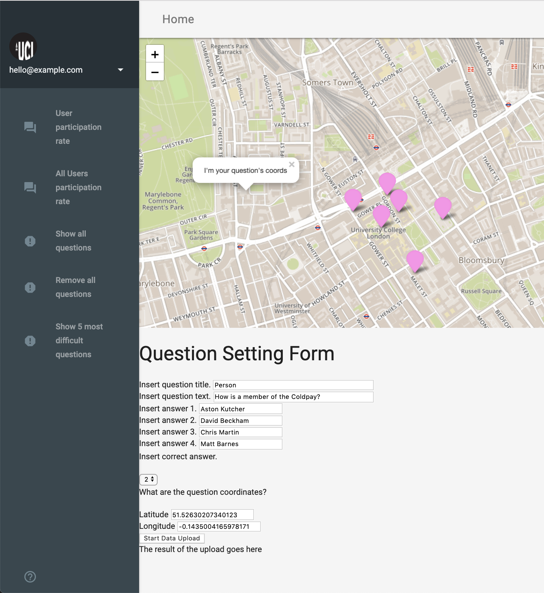

# ucesapc-server
Technical Guide 
================

1.Quiz app
==========

The Quiz app is a location-based app that runs on Android phones using
PhoneGap and Material design. When the app is launched it loads a series
of quiz questions and receives the user's location. Once a quiz point is
within the user's radio, a pop-up in the point opens prompting the user
to answer the question. The questions within the app relate to a wide
variety of historical and landmark topics.

System requirements
-------------------

The Quiz app supports Android model above 2.3.3 Gingerbread (API Level
10). The app was executed on the Cordova PhoneGap.

### How to deploy the code?

To deploy this code, first download and SSH file transfer software such
as BitVise (1) for Windows or Cyberduck (2) for Mac. Set up the
SSH to connect to the Ubuntu Server by inserting a port number and host.
For the authentication provide a username and password (**Figure 1**).
Once the SSH software is connected to SFTP client, navigate to the local
server using the following command *cd /home/username*(3)$*/code.*
Use the Linux (ubuntu) terminal from the SSH software to clone the
github repositories (ucesapc-quiz(4) and ucesapc-serve(5)) to
the local server using the command line (*git clone HTTPS URL*(6)).
Start the server from the cloned ucesapc-server repository by navigating
to *cd /home/username*(3)*/code/ucesapc-server.* Run the following
command *node httpServer.js* to debug the server then *pm2 start
httpServer.js* and *pm2 start httpsServer.js* to start the server. In
order to deploy the quiz app on an Android device, navigate to the
ucesapc-quiz folder cloned in the local server using the following
command line (*cd /home/username*(3)*/code/ucesapc-quiz/ucesapc/*).
Using the Linux (Ubuntu) terminal from the SSH software run the code
"*phonegap serve"* in the command line. From the smartphone device,
launch the PhoneGap app and type the server address in the empty field
and connect.

**Figure 1:** Show a BitVise interface, to access the server and virtual
machine. (Taken from: Ellul, 2019.)

### How to test the code?

Testing the code can be done by downloading the PhoneGap by logging in
the server (**Figure 2).** For a perfect functioning app the outcome
once the question is answered should display, a red marker for the wrong
answers, a green marker for the correct answers and a pink marker for a
yet to be answered question (**Figure 2**). Note, tests can only be
carried out with the server (e.g. httpServe.js) running.

**Figure 2:** Shows the process of initiating the Quip App on PhoneGap
(left) to the testing of the app (right).

| Files                      | Function                                                                                                                         |
|----------------------------|----------------------------------------------------------------------------------------------------------------------------------|
| Index.html                 | Contains the code for the web client side (e.g. material design and leaflet functions). The main function is to display the app. |
| Instructions.html          | Contains user guide instruction to inform and guide new users.                                                                   |
| leaflet.awesome-markers.js | Provides styling for the leaflet features such as markers.                                                                       |
| leaflet.js                 | Provides mp tile to the application (e.g. mapbox and open street map)                                                            |
| leafletFunctions.js        | Makes all the the request to the database (e.g. get the form data )                                                              |
| startup.js                 | Responsible for initiating any desired function when the app is launched (e.g. load the quiz points and tracks user position)    |
| uploadData.js              | Responsible for uploading the quiz answers,to the database                                                                       |
| userTracking.js            | Provides users current position and all location-based function.                                                                 |
| utilities.js               | Processes port number from the port.xml file and lots form data (i.e. quiz points)                                               |

**Table 1:** Illustrates all HTML and javascript files deployed in the Quiz App.

2.Question app
==============

The Question app is a location-based app that runs on a web browser
using Material design. 
When the app is launched it loads a series of questions points that were
previously inserted by the user into the database. Questions points can
be inserted from by clicking on the map and filling in the Question
Setting Form.

System requirements
-------------------

The Quiz app supports the following browsers: Version 73.0.3683.86
(Official Build) (64-bit) and Version 12.0.1 (14606.2.104.1.1).

### How to deploy the code?

To deploy this code, first download an SSH file transfer software such
as BitVise(1)(**Figure 1**) for Windows or Cyberduck(2) for
Mac. Set up the SSH software so as connect to the Ubuntu Server by
inserting a port number and host. For the authentication provide a
username and password. Once the SSH software is connected to SFTP
client, navigate to the local server using the following command *cd
/home/username*(3)*/code.* Use the Linux (Ubuntu ) terminal from
the SSH software to clone the GitHub repositories
(ucesapc-question(7) and ucesapc-serve(5)) to the local server
using the command line (*git clone HTTPS URL*(6)). Start the server
from the cloned ucesapc-server repository by navigating to *cd
/home/username*(3)*/code/ucesapc-server.* Run the following command
*node httpServer.js* to debug the server then *pm2 start httpServer.js*
and *pm2 start httpsServer.js* to start the server. In order to deploy
the quiz app on an Android device, navigate to the ucesapc-question
folder cloned in the local server using the following command line (*cd
/home/username*(3)*/code/ucesapc-quiz/ucesapc/*). Using the Linux
(Ubuntu) terminal from the SSH software run the code "*phonegap serve"*
in the command line. From the smartphone device, launch the browser and
type the server address in the Url field.

### How to test the code?

Testing the code requires opening the browser and typing the URL of the
server host followed by a port ID (if necessary). The launched app
should have an interface as shown in (**Figure 3)**. When filling in the
form and pressing the start data upload button and a message "row
inserted" show display at the bottom of the page confirm that the
questions were added to the database. Note, tests can only be carried
out with the server (e.g. httpServe.js) running.

**Figure 3:** Question App interface in the browser, before

| Files                      | Function                                                                                                                         |
|----------------------------|----------------------------------------------------------------------------------------------------------------------------------|
| Index.html                 | Contains the code for the web client side (e.g. material design and leaflet functions). The main function is to display the app. |
| Instructions.html          | Contains user guide instruction to inform and guide new users.                                                                   |
| leaflet.awesome-markers.js | Provides styling for the leaflet features such as markers.                                                                       |
| leaflet.js                 | Provides mp tile to the application (e.g. mapbox and open street map)                                                            |
| leafletFunctions.js        | Makes all the the request to the database (e.g. get the form data )                                                              |
| startup.js                 | Responsible for initiating any desired function when the app is launched (e.g. load the quiz points)                             |
| uploadData.js              | Responsible for uploading the quiz pointsto the database                                                                         |
| utilities.js               | Processes port number from the port.xml file and lots form data (i.e. quiz points)                                               |

**Table 2:** Illustrates all HTML and javascript files deployed in the
Quiz App.

3.Server
========

System requirements
-------------------

The server supports Ubuntu 14.04/15.10, CentOS 6.x, Red Hat Enterprise
Linux (RHEL) 7.x and Debian 7.7.

### How to deploy the code?

The server is deployed using NodeJS run-time environment (**Table 3**).

### How to test the code?

To test the code the server has to run in debug mode so that any errors
can be seen in the console. This is done by first navigation to the
folder directory containing the *httpServer.js* stopping the server
typing the command line (pm2 stop *server\_number*) in the Ubuntu
terminal. Then type the following command line in the Ubuntu terminal:
*node httpServer.js.* To test the code. If no error is shown in the
console log, then the code is running perfectly, otherwise, an error
message will be displayed.

| Files          | Function                                                                                                        |
|----------------|-----------------------------------------------------------------------------------------------------------------|
| httpServer.js  | Contains SQL queries to perform operations through HTTP protocol between the client and the database side.      |
| httpsServer.js | Contains SQL queries to perform operations through the,HTTPS protocol between the client and the database side. |

**Table 3:** illustrates all javascript files deployed in the Server.

4.References
==============

Ellul, Claire, 2019. Web and Mobile GIS: Lecture slides from module Web
and Mobile GIS - Apps and programming. MSc Geospatial Sciences,
University College London, London, UK

*1. https://www.bitvise.com/sshclient-download*

*2. https://cyberduck.io/download/*

*3. Username: refers to username insert in the authentication field in
the SSH software.*

*4. <https://github.com/ucl-geospatial/ucesapc-quiz>*

*5.
[https://github.com/ucl-geospatial/ucesapc-server](https://github.com/ucl-geospatial/ucesapc-quiz)*

*6. HTTPS URL: refers to URL link to the repository on Github.*

*7.
[https://github.com/ucl-geospatial/ucesapc-qu](https://github.com/ucl-geospatial/ucesapc-quiz)estion*

5.Appendix
==============

Code modified from Ellul, 2019 practicals for the Web and Mobile GIS App
course at UCL as part of the MSc Geospatial Science program.

Quiz App Code
=============

  -----------------------------------------------------------------------------------------------------------------------------------------------------------------------------------------------------------------------------------------------------------------------------------------------------------------------------------------------------------------------------
  **index.html**
  -----------------------------------------------------------------------------------------------------------------------------------------------------------------------------------------------------------------------------------------------------------------------------------------------------------------------------------------------------------------------------
  \<!doctype html\>\
  \<**html** lang=\"en\"\>\
  \<**head**\>\
  \<**meta** charset=\"utf-8\"\>\
  \<**meta** http-equiv=\"X-UA-Compatible\" content=\"IE=edge\"\>\
  \<**meta** name=\"description\" content=\"A front-end template that helps you build fast, modern mobile web apps.\"\>\
  \<**meta** name=\"viewport\" content=\"width=device-width, initial-scale=1.0, minimum-scale=1.0\"\>\
  \<**title**\>Material Design Lite\</**title**\>\
  \
  \<!\-- Add to homescreen for Chrome on Android \--\>\
  \<**meta** name=\"mobile-web-app-capable\" content=\"yes\"\>\
  \<**link** rel=\"icon\" sizes=\"192x192\" href=\"images/android-desktop.png\"\>\
  \
  \<!\-- Add to homescreen for Safari on iOS \--\>\
  \<**meta** name=\"apple-mobile-web-app-capable\" content=\"yes\"\>\
  \<**meta** name=\"apple-mobile-web-app-status-bar-style\" content=\"black\"\>\
  \<**meta** name=\"apple-mobile-web-app-title\" content=\"Material Design Lite\"\>\
  \<**link** rel=\"apple-touch-icon-precomposed\" href=\"images/ios-desktop.png\"\>\
  \
  \<!\-- Tile icon for Win8 (144x144 + tile color) \--\>\
  \<**meta** name=\"msapplication-TileImage\" content=\"images/touch/ms-touch-icon-144x144-precomposed.png\"\>\
  \<**meta** name=\"msapplication-TileColor\" content=\"\#3372DF\"\>\
  \
  \<**link** rel=\"shortcut icon\" href=\"images/favicon.png\"\>\
  \
  \<!\-- SEO: If your mobile URL is different from the desktop URL, add a canonical link to the desktop page https://developers.google.com/webmasters/smartphone-sites/feature-phones \--\>\
  \<!\--\
  \<link rel=\"canonical\" href=\"http://www.example.com/\"\>\
  \--\>\
  \
  \<**link** rel=\"stylesheet\" href=\"https://fonts.googleapis.com/css?family=Roboto:regular,bold,italic,thin,light,bolditalic,black,medium&amp;lang=en\"\>\
  \<**link** rel=\"stylesheet\" href=\"https://fonts.googleapis.com/icon?family=Material+Icons\"\>\
  \<**link** rel=\"stylesheet\" href=\"https://code.getmdl.io/1.3.0/material.cyan-light\_blue.min.css\"\>\
  \<**link** rel=\"stylesheet\" href=\"css/styles.css\"\>\
  \<**style**\>\
  \#view-source {\
  position: fixed;\
  display: block;\
  right: 0;\
  bottom: 0;\
  margin-right: 40px;\
  margin-bottom: 40px;\
  z-index: 900;\
  }\
  \</**style**\>\
  \<!\-- the following links add the CSS and Javascript required for the Leaflet Map \--\>\
  \<**link** rel=\"stylesheet\" href=\"https://unpkg.com/leaflet\@1.1.0/dist/leaflet.css\"\\\
  integrity=\"sha512-wcw6ts8Anuw10Mzh9Ytw4pylW8+NAD4ch3lqm9lzAsTxg0GFeJgoAtxuCLREZSC5lUXdVyo/7yfsqFjQ4S+aKw==\"\
  crossorigin=\"\"/\>\
  \
  \<**script** src=\"https://unpkg.com/leaflet\@1.1.0/dist/leaflet.js\"\
  integrity=\"sha512-mNqn2Wg7tSToJhvHcqfzLMU6J4mkOImSPTxVZAdo+lcPlk+GhZmYgACEe0x35K7YzW1zJ7XyJV/TT1MrdXvMcA==\"\
  crossorigin=\"\"\>\</**script**\>\
  \
  \<!\--the following CSS is used to set the size of the Map\--\>\
  \<**style** type=\"text/css\"\>\
  \#mapid{height: 500px;}\
  \</**style**\>\
  \
  \<!\--the following links incorporate the CSS required for custom icon creation \--\>\
  \<**link** rel=\"stylesheet\" href=\"./css/ionicons.min.css\"\>\
  \<**link** rel=\"stylesheet\" href=\"./css/leaflet.awesome-markers.css\"\>\
  \<**script** src=\"./js/leaflet.awesome-markers.js\"\>\</**script**\>\
  \<**script** src=\"https://www.w3schools.com/lib/w3.js\"\>\</**script**\>\
  \</**head**\>\
  \<**script** src=\"js/startup.js\"\>\</**script**\>\
  \<**body**\>\
  \<**div** class=\"demo-layout mdl-layout mdl-js-layout mdl-layout\--fixed-drawer mdl-layout\--fixed-header\"\>\
  \<**header** class=\"demo-header mdl-layout\_\_header mdl-color\--grey-100 mdl-color-text\--grey-600\"\>\
  \<**div** class=\"mdl-layout\_\_header-row\"\>\
  \<**span** class=\"mdl-layout-title\"\>Home\</**span**\>\
  \<**div** class=\"mdl-layout-spacer\"\>\</**div**\>\
  \<**div** class=\"mdl-textfield mdl-js-textfield mdl-textfield\--expandable\"\>\
  \<**label** class=\"mdl-button mdl-js-button mdl-button\--icon\" for=\"search\"\>\
  \<**i** class=\"material-icons\"\>search\</**i**\>\
  \</**label**\>\
  \<**div** class=\"mdl-textfield\_\_expandable-holder\"\>\
  \<**input** class=\"mdl-textfield\_\_input\" type=\"text\" id=\"search\"\>\
  \<**label** class=\"mdl-textfield\_\_label\" for=\"search\"\>Enter your query\...\</**label**\>\
  \</**div**\>\
  \</**div**\>\
  \<**button** class=\"mdl-button mdl-js-button mdl-js-ripple-effect mdl-button\--icon\" id=\"hdrbtn\"\>\
  \<**i** class=\"material-icons\"\>more\_vert\</**i**\>\
  \</**button**\>\
  \<**ul** class=\"mdl-menu mdl-js-menu mdl-js-ripple-effect mdl-menu\--bottom-right\" for=\"hdrbtn\"\>\
  \<**li** class=\"mdl-menu\_\_item\"\>\<**a** href=\"Instructions.html\"\>Help!\</**a**\>\</**li**\>\
  \</**ul**\>\
  \</**div**\>\
  \</**header**\>\
  \<**div** class=\"demo-drawer mdl-layout\_\_drawer mdl-color\--blue-grey-900 mdl-color-text\--blue-grey-50\"\>\
  \<**header** class=\"demo-drawer-header\"\>\
  \<**img** src=\"images/ucl.png\" class=\"demo-avatar\"\>\
  \<**div** class=\"demo-avatar-dropdown\"\>\
  \<**span**\>hello\@example.com\</**span**\>\
  \<**div** class=\"mdl-layout-spacer\"\>\</**div**\>\
  \<**button** id=\"accbtn\" class=\"mdl-button mdl-js-button mdl-js-ripple-effect mdl-button\--icon\"\>\
  \<**i** class=\"material-icons\" role=\"presentation\"\>arrow\_drop\_down\</**i**\>\
  \<**span** class=\"visuallyhidden\"\>Accounts\</**span**\>\
  \</**button**\>\
  \<**ul** class=\"mdl-menu mdl-menu\--bottom-right mdl-js-menu mdl-js-ripple-effect\" for=\"accbtn\"\>\
  \<**li** class=\"mdl-menu\_\_item\"\>hello\@example.com\</**li**\>\
  \<**li** class=\"mdl-menu\_\_item\"\>info\@example.com\</**li**\>\
  \<**li** class=\"mdl-menu\_\_item\"\>\<**i** class=\"material-icons\"\>add\</**i**\>Add another account\...\</**li**\>\
  \</**ul**\>\
  \</**div**\>\
  \</**header**\>\
  \<**nav** class=\"demo-navigation mdl-navigation mdl-color\--blue-grey-800\"\>\
  \<**a** class=\"mdl-navigation\_\_link\" href=\"\"onclick=\'getCorrectAnswers();return false;\'\>\<**i** class=\"mdl-color-text\--blue-grey-400 material-icons\" role=\"presentation\"\>forum\</**i**\>Your Points\</**a**\>\
  \<**a** class=\"mdl-navigation\_\_link\" href=\"\"onclick=\'getRanking();return false;\'\>\<**i** class=\"mdl-color-text\--blue-grey-400 material-icons\" role=\"presentation\"\>report\</**i**\>Your Ranking\</**a**\>\
  \<**a** class=\"mdl-navigation\_\_link\" href=\"\"onclick=\'getGraph();return false;\'\>\<**i** class=\"mdl-color-text\--blue-grey-400 material-icons\" role=\"presentation\"\>forum\</**i**\>Show top 5 scorers\</**a**\>\
  \<**a** class=\"mdl-navigation\_\_link\" href=\"\"onclick=\'showAllQuestions();return false;\'\>\<**i** class=\"mdl-color-text\--blue-grey-400 material-icons\" role=\"presentation\"\>report\</**i**\>Add Five questions closer to me \</**a**\>\
  \<**a** class=\"mdl-navigation\_\_link\" href=\"\"onclick=\'AddAllQuestions();return false;\'\>\<**i** class=\"mdl-color-text\--blue-grey-400 material-icons\" role=\"presentation\"\>report\</**i**\>Remove Five questions closer to me \</**a**\>\
  \<**div** class=\"mdl-layout-spacer\"\>\</**div**\>\
  \<**a** class=\"mdl-navigation\_\_link\" href=\"\"\>\<**i** class=\"mdl-color-text\--blue-grey-400 material-icons\" role=\"presentation\"\>help\_outline\</**i**\>\<**span** class=\"visuallyhidden\"\>Help\</**span**\>\</**a**\>\
  \</**nav**\>\
  \</**div**\>\
  \<!\-- \<main class=\"mdl-layout\_\_content mdl-color\--grey-100\"\>\
  \
\
  \
\</div\>\
  \
div goes here \</div\>\
  \</div\>\
  \</main\> \--\>\
  \<**main** class=\"mdl-layout\_\_content mdl-color\--grey-100\"\>\
  \<**div** id=\"mapid\" style=\"width: 350; height: 350;\"\>\
  \</**div**\>\
  \<**div** id=\"ajaxtext\" style=\"width: 1600px; height: 20px;\"\>\
  \<**svg** width=\"350\" height=\"350\"\>\</**svg**\>\
  \</**body**\>\</**div**\>\
  \</**div**\>\
  \
  \</**main**\>\
  \</**div**\>\
  \<**script** src=\"https://code.getmdl.io/1.3.0/material.min.js\"\>\</**script**\>\
  \<**script** src=\"https://d3js.org/d3.v5.min.js\"\>\</**script**\>\
  \<**script** src=\"js/rhMenu.js\"\>\</**script**\>\
  \<**script** src=\"js/leaflet.js\"\>\</**script**\>\
  \<**script** src=\"js/leafletFunctions.js\"\>\</**script**\>\
  \<**script** src=\"js/userTracking.js\"\>\</**script**\>\
  \<**script** src=\"js/utilities.js\"\>\</**script**\>\
  \<**script** src=\"js/ajax.js\"\>\</**script**\>\
  \<**script** src=\"js/uploadData.js\"\>\</**script**\>\
  \<**script**\>startup(); \</**script**\>\
  \</**body**\>\
  \</**html**\>

  **instructions.html**

  \<!DOCTYPE HTML PUBLIC \"-//W3C//DTD HTML 4.0 Transitional//EN\"\>\
  \<**HTML**\>\
  \<**HEAD**\>\
  \<**META** HTTP-EQUIV=\"CONTENT-TYPE\" CONTENT=\"text/html; charset=utf-8\"\>\
  \<**TITLE**\>\</**TITLE**\>\
  \<**META** NAME=\"GENERATOR\" CONTENT=\"LibreOffice 4.1.6.2 (Linux)\"\>\
  \<**META** NAME=\"CREATED\" CONTENT=\"0;0\"\>\
  \<**META** NAME=\"CHANGED\" CONTENT=\"0;0\"\>\
  \<**STYLE** TYPE=\"text/css\"\>\
  \<!\--\
  \@page { margin: 1in }\
  P { margin-bottom: 0.08in }\
  H2 { margin-top: 0.25in; margin-bottom: 0.08in; direction: ltr; line-height: 100%; page-break-inside: avoid; widows: 2; orphans: 2 }\
  H2.western { font-family: \"Arial\", serif; font-size: 16pt; font-weight: normal }\
  H2.cjk { font-family: \"Arial\"; font-size: 16pt; font-weight: normal }\
  H2.ctl { font-family: \"Arial\"; font-size: 16pt; font-weight: normal }\
  H3 { margin-top: 0.22in; margin-bottom: 0.06in; direction: ltr; color: \#434343; line-height: 100%; page-break-inside: avoid; widows: 2; orphans: 2 }\
  H3.western { font-family: \"Arial\", serif; font-weight: normal }\
  H3.cjk { font-family: \"Arial\"; font-weight: normal }\
  H3.ctl { font-family: \"Arial\"; font-weight: normal }\
  \--\>\
  \</**STYLE**\>\
  \</**HEAD**\>\
  \<**BODY** LANG=\"en-US\" DIR=\"LTR\"\>\
  \<**H2** CLASS=\"western\"\>\<**A** NAME=\"\_13owz496r8gi\"\>\</**A**\>How to Answer\
  Questions?\</**H2**\>\
  \<**H3** CLASS=\"western\"\>\<**A** NAME=\"\_qq7a7v2o3eam\"\>\</**A**\>Step 1: Initial\
  Screen displayed\</**H3**\>\
  \<**P** STYLE=\"margin-bottom: 0in\"\>The initial screen displays the map on\
  top with some quiz points as pink markers and the user\'s location\
  in blue marker(Fig 1).\</**P**\>\
  \<**P** STYLE=\"margin-bottom: 0in\"\>\<**BR**\>\
  \</**P**\>\
  \<**P** ALIGN=CENTER STYLE=\"margin-bottom: 0.14in; line-height: 100%\"\>\<**IMG** SRC=\"images/User\_Guide\_QuizApp\_html\_ca17cbcc.png\" NAME=\"image18.png\" ALIGN=BOTTOM HSPACE=12 VSPACE=12 WIDTH=197 HEIGHT=305 BORDER=0\>\</**P**\>\
  \<**P** ALIGN=CENTER STYLE=\"margin-bottom: 0in\"\>\<**B**\>Figure 1: \</**B**\>Shows\
  question points in pink and the user\'s current location in blue.\</**P**\>\
  \<**H3** CLASS=\"western\" ALIGN=LEFT\>\<**A** NAME=\"\_g0m0yqdxgxf\"\>\</**A**\>Step 2:\
  Answering the question\</**H3**\>\
  \<**P** STYLE=\"margin-bottom: 0in\"\>When the user is close enough to the\
  question point a pop-up is triggered to the user\'s closest question\
  (Figure 2). The answer is chosen by clicking one of the radio buttons\
  (Figure2).\</**P**\>\
  \<**P** ALIGN=CENTER STYLE=\"margin-bottom: 0in\"\>\<**IMG** SRC=\"images/User\_Guide\_QuizApp\_html\_38cb6394.png\" NAME=\"image16.png\" ALIGN=BOTTOM HSPACE=12 VSPACE=12 WIDTH=256 HEIGHT=236 BORDER=0\>\<**IMG** SRC=\"images/User\_Guide\_QuizApp\_html\_8f318e71.png\" NAME=\"image6.png\" ALIGN=BOTTOM HSPACE=12 VSPACE=12 WIDTH=219 HEIGHT=239 BORDER=0\>\</**P**\>\
  \<**P** ALIGN=CENTER STYLE=\"margin-bottom: 0in\"\>\<**B**\>Figure 2: \</**B**\>Shows\
  pop-up message to the user closest question(left) and user selected\
  answer (right).\</**P**\>\
  \<**H3** CLASS=\"western\" ALIGN=LEFT\>\<**A** NAME=\"\_93duxgvqg93z\"\>\</**A**\>Step 3:\
  Outcome of the question\</**H3**\>\
  \<**P** STYLE=\"margin-bottom: 0in\"\>Once the answer is selected and the\
  submit answer button is pressed, the pop-up message closes and the\
  quiz point turns green or red depending if the answer provided was\
  right (green) or wrong (red) (Figure 3).\</**P**\>\
  \<**P** STYLE=\"margin-bottom: 0in\"\>\<**BR**\>\
  \</**P**\>\
  \<**P** ALIGN=CENTER STYLE=\"margin-bottom: 0.14in; line-height: 100%\"\>\<**IMG** SRC=\"images/User\_Guide\_QuizApp\_html\_9b0ba6a3.png\" NAME=\"image10.png\" ALIGN=BOTTOM HSPACE=12 VSPACE=12 WIDTH=288 HEIGHT=288 BORDER=0\>\</**P**\>\
  \<**P** ALIGN=CENTER STYLE=\"margin-bottom: 0in\"\>\<**B**\>Figure 3: \</**B**\>Shows the\
  outcome once the question is answered, the wrong answer (red), the\
  correct answer (green) and yet to be answered (pink).\</**P**\>\
  \<**H2** CLASS=\"western\" ALIGN=LEFT\>\<**A** NAME=\"\_pliup2xx9wah\"\>\</**A**\>App\
  Functionalities\</**H2**\>\
  \<**H3** CLASS=\"western\" ALIGN=LEFT\>\<**A** NAME=\"\_4t1xioghuxv3\"\>\</**A**\>Quiz App\
  Features\</**H3**\>\
  \<**P** STYLE=\"margin-bottom: 0in\"\>Menu-based options are composed of five\
  functionalities (Figure 4 and Table 1) that are described as follow:\</**P**\>\
  \<**OL**\>\
  \<**LI**\>\<**P** STYLE=\"margin-bottom: 0in\"\>Your Points: shows the number of\
  correctly answered questions by the user;\</**P**\>\
  \<**LI**\>\<**P** STYLE=\"margin-bottom: 0in\"\>Your Ranking: shows the user\
  ranking position in relation to any other user.\
  \</**P**\>\
  \<**LI**\>\<**P** STYLE=\"margin-bottom: 0in\"\>Show top 5 scorers: shows the five\
  best-ranked users;\</**P**\>\
  \<**LI**\>\<**P** STYLE=\"margin-bottom: 0in\"\>Add Five question closer to me:\
  adds a map layer with the five closest questions added by any user\
  in relation to the user\'s current position;\</**P**\>\
  \<**LI**\>\<**P** STYLE=\"margin-bottom: 0in\"\>Remove Five questions closer to\
  me: removes the map layer with the five closest questions added by\
  any user in relation to the user\'s current position returning to the\
  normal viewing\</**P**\>\
  \</**OL**\>\
  \<**P** STYLE=\"margin-bottom: 0in\"\>\<**BR**\>\
  \</**P**\>\
  \<**P** ALIGN=CENTER STYLE=\"margin-bottom: 0in\"\>\<**IMG** SRC=\"images/User\_Guide\_QuizApp\_html\_62faf1bc.png\" NAME=\"image9.png\" ALIGN=BOTTOM HSPACE=12 VSPACE=12 WIDTH=196 HEIGHT=362 BORDER=0\>\</**P**\>\
  \<**P** ALIGN=CENTER STYLE=\"margin-bottom: 0in\"\>\<**B**\>Figure 4: \</**B**\>Shows\
  left side menu functionalities.\</**P**\>\
  \<**P** STYLE=\"margin-bottom: 0in\"\>\<**BR**\>\
  \</**P**\>\
  \<**TABLE** WIDTH=602 CELLPADDING=7 CELLSPACING=0\>\
  \<**COL** WIDTH=286\>\
  \<**COL** WIDTH=286\>\
  \<**TR** VALIGN=TOP\>\
  \<**TD** WIDTH=286 HEIGHT=16 BGCOLOR=\"\#ffffff\" STYLE=\"border: 1.00pt solid \#000001; padding: 0.07in\"\>\
  \<**P** ALIGN=LEFT STYLE=\"margin-bottom: 0in; background: \#ffffff; border: none; padding: 0in; page-break-inside: auto; widows: 0; orphans: 0; page-break-after: auto\"\>\
  \<**BR**\>\
  \</**P**\>\
  \<**P** ALIGN=LEFT STYLE=\"background: \#ffffff; border: none; padding: 0in; page-break-inside: auto; widows: 0; orphans: 0; page-break-after: auto\"\>\
  \<**B**\>Menu Functionalities\</**B**\>\</**P**\>\
  \</**TD**\>\
  \<**TD** WIDTH=286 BGCOLOR=\"\#ffffff\" STYLE=\"border: 1.00pt solid \#000001; padding: 0.07in\"\>\
  \<**H2** CLASS=\"western\" ALIGN=LEFT\>\<**A** NAME=\"\_mk3sclr9cc2x\"\>\</**A**\>\<**FONT** SIZE=2 STYLE=\"font-size: 11pt\"\>\<**B**\>Events\</**B**\>\</**FONT**\>\</**H2**\>\
  \</**TD**\>\
  \</**TR**\>\
  \<**TR** VALIGN=TOP\>\
  \<**TD** WIDTH=286 BGCOLOR=\"\#ffffff\" STYLE=\"border: 1.00pt solid \#000001; padding: 0.07in\"\>\
  \<**P** ALIGN=LEFT STYLE=\"margin-bottom: 0in; background: \#ffffff; border: none; padding: 0in; page-break-inside: auto; widows: 0; orphans: 0; page-break-after: auto\"\>\
  \<**BR**\>\
  \</**P**\>\
  \<**P** ALIGN=LEFT STYLE=\"margin-bottom: 0in; background: \#ffffff; border: none; padding: 0in; page-break-inside: auto; widows: 0; orphans: 0; page-break-after: auto\"\>\
  \<**BR**\>\
  \</**P**\>\
  \<**P** ALIGN=LEFT STYLE=\"margin-bottom: 0in; background: \#ffffff; border: none; padding: 0in; page-break-inside: auto; widows: 0; orphans: 0; page-break-after: auto\"\>\
  \<**BR**\>\
  \</**P**\>\
  \<**P** ALIGN=LEFT STYLE=\"margin-bottom: 0in; background: \#ffffff; border: none; padding: 0in; page-break-inside: auto; widows: 0; orphans: 0; page-break-after: auto\"\>\
  \<**BR**\>\
  \</**P**\>\
  \<**P** ALIGN=LEFT STYLE=\"margin-bottom: 0in; background: \#ffffff; border: none; padding: 0in; page-break-inside: auto; widows: 0; orphans: 0; page-break-after: auto\"\>\
  \<**BR**\>\
  \</**P**\>\
  \<**P** ALIGN=LEFT STYLE=\"margin-bottom: 0in; background: \#ffffff; border: none; padding: 0in; page-break-inside: auto; widows: 0; orphans: 0; page-break-after: auto\"\>\
  \<**BR**\>\
  \</**P**\>\
  \<**P** ALIGN=LEFT STYLE=\"margin-bottom: 0in; background: \#ffffff; border: none; padding: 0in; page-break-inside: auto; widows: 0; orphans: 0; page-break-after: auto\"\>\
  \<**BR**\>\
  \</**P**\>\
  \<**P** ALIGN=LEFT STYLE=\"margin-bottom: 0in; background: \#ffffff; border: none; padding: 0in; page-break-inside: auto; widows: 0; orphans: 0; page-break-after: auto\"\>\
  \<**BR**\>\
  \</**P**\>\
  \<**P** ALIGN=LEFT STYLE=\"margin-bottom: 0in; background: \#ffffff; border: none; padding: 0in; page-break-inside: auto; widows: 0; orphans: 0; page-break-after: auto\"\>\
  \<**BR**\>\
  \</**P**\>\
  \<**P** ALIGN=LEFT STYLE=\"background: \#ffffff; border: none; padding: 0in; page-break-inside: auto; widows: 0; orphans: 0; page-break-after: auto\"\>\
  \<**IMG** SRC=\"images/User\_Guide\_QuizApp\_html\_7c768b1e.png\" NAME=\"image11.png\" ALIGN=BOTTOM HSPACE=12 VSPACE=12 WIDTH=286 HEIGHT=91 BORDER=0\>\</**P**\>\
  \</**TD**\>\
  \<**TD** WIDTH=286 BGCOLOR=\"\#ffffff\" STYLE=\"border: 1.00pt solid \#000001; padding: 0.07in\"\>\
  \<**H2** CLASS=\"western\" ALIGN=LEFT\>\<**A** NAME=\"\_mk3sclr9cc2x1\"\>\</**A**\>\<**IMG** SRC=\"images/User\_Guide\_QuizApp\_html\_e6681d10.png\" NAME=\"image17.png\" ALIGN=BOTTOM HSPACE=12 VSPACE=12 WIDTH=183 HEIGHT=351 BORDER=0\>\</**H2**\>\
  \</**TD**\>\
  \</**TR**\>\
  \<**TR** VALIGN=TOP\>\
  \<**TD** WIDTH=286 BGCOLOR=\"\#ffffff\" STYLE=\"border: 1.00pt solid \#000001; padding: 0.07in\"\>\
  \<**P** ALIGN=LEFT STYLE=\"margin-bottom: 0in; background: \#ffffff; border: none; padding: 0in; page-break-inside: auto; widows: 0; orphans: 0; page-break-after: auto\"\>\
  \<**BR**\>\
  \</**P**\>\
  \<**P** ALIGN=LEFT STYLE=\"margin-bottom: 0in; background: \#ffffff; border: none; padding: 0in; page-break-inside: auto; widows: 0; orphans: 0; page-break-after: auto\"\>\
  \<**BR**\>\
  \</**P**\>\
  \<**P** ALIGN=LEFT STYLE=\"margin-bottom: 0in; background: \#ffffff; border: none; padding: 0in; page-break-inside: auto; widows: 0; orphans: 0; page-break-after: auto\"\>\
  \<**BR**\>\
  \</**P**\>\
  \<**P** ALIGN=LEFT STYLE=\"margin-bottom: 0in; background: \#ffffff; border: none; padding: 0in; page-break-inside: auto; widows: 0; orphans: 0; page-break-after: auto\"\>\
  \<**BR**\>\
  \</**P**\>\
  \<**P** ALIGN=LEFT STYLE=\"margin-bottom: 0in; background: \#ffffff; border: none; padding: 0in; page-break-inside: auto; widows: 0; orphans: 0; page-break-after: auto\"\>\
  \<**BR**\>\
  \</**P**\>\
  \<**P** ALIGN=LEFT STYLE=\"margin-bottom: 0in; background: \#ffffff; border: none; padding: 0in; page-break-inside: auto; widows: 0; orphans: 0; page-break-after: auto\"\>\
  \<**BR**\>\
  \</**P**\>\
  \<**P** ALIGN=LEFT STYLE=\"margin-bottom: 0in; background: \#ffffff; border: none; padding: 0in; page-break-inside: auto; widows: 0; orphans: 0; page-break-after: auto\"\>\
  \<**BR**\>\
  \</**P**\>\
  \<**P** ALIGN=LEFT STYLE=\"margin-bottom: 0in; background: \#ffffff; border: none; padding: 0in; page-break-inside: auto; widows: 0; orphans: 0; page-break-after: auto\"\>\
  \<**BR**\>\
  \</**P**\>\
  \<**P** ALIGN=LEFT STYLE=\"margin-bottom: 0in; background: \#ffffff; border: none; padding: 0in; page-break-inside: auto; widows: 0; orphans: 0; page-break-after: auto\"\>\
  \<**BR**\>\
  \</**P**\>\
  \<**P** ALIGN=LEFT STYLE=\"background: \#ffffff; border: none; padding: 0in; page-break-inside: auto; widows: 0; orphans: 0; page-break-after: auto\"\>\
  \<**IMG** SRC=\"images/User\_Guide\_QuizApp\_html\_c13e81d9.png\" NAME=\"image3.png\" ALIGN=BOTTOM HSPACE=12 VSPACE=12 WIDTH=286 HEIGHT=96 BORDER=0\>\</**P**\>\
  \</**TD**\>\
  \<**TD** WIDTH=286 BGCOLOR=\"\#ffffff\" STYLE=\"border: 1.00pt solid \#000001; padding: 0.07in\"\>\
  \<**H2** CLASS=\"western\" ALIGN=LEFT\>\<**A** NAME=\"\_h8y8co7irhrq\"\>\</**A**\>\<**IMG** SRC=\"images/User\_Guide\_QuizApp\_html\_84bfbf10.png\" NAME=\"image19.png\" ALIGN=BOTTOM HSPACE=12 VSPACE=12 WIDTH=191 HEIGHT=361 BORDER=0\>\</**H2**\>\
  \</**TD**\>\
  \</**TR**\>\
  \<**TR** VALIGN=TOP\>\
  \<**TD** WIDTH=286 BGCOLOR=\"\#ffffff\" STYLE=\"border: 1.00pt solid \#000001; padding: 0.07in\"\>\
  \<**P** ALIGN=LEFT STYLE=\"margin-bottom: 0in; background: \#ffffff; border: none; padding: 0in; page-break-inside: auto; widows: 0; orphans: 0; page-break-after: auto\"\>\
  \<**BR**\>\
  \</**P**\>\
  \<**P** ALIGN=LEFT STYLE=\"margin-bottom: 0in; background: \#ffffff; border: none; padding: 0in; page-break-inside: auto; widows: 0; orphans: 0; page-break-after: auto\"\>\
  \<**BR**\>\
  \</**P**\>\
  \<**P** ALIGN=LEFT STYLE=\"margin-bottom: 0in; background: \#ffffff; border: none; padding: 0in; page-break-inside: auto; widows: 0; orphans: 0; page-break-after: auto\"\>\
  \<**BR**\>\
  \</**P**\>\
  \<**P** ALIGN=LEFT STYLE=\"margin-bottom: 0in; background: \#ffffff; border: none; padding: 0in; page-break-inside: auto; widows: 0; orphans: 0; page-break-after: auto\"\>\
  \<**BR**\>\
  \</**P**\>\
  \<**P** ALIGN=LEFT STYLE=\"margin-bottom: 0in; background: \#ffffff; border: none; padding: 0in; page-break-inside: auto; widows: 0; orphans: 0; page-break-after: auto\"\>\
  \<**BR**\>\
  \</**P**\>\
  \<**P** ALIGN=LEFT STYLE=\"background: \#ffffff; border: none; padding: 0in; page-break-inside: auto; widows: 0; orphans: 0; page-break-after: auto\"\>\
  \<**IMG** SRC=\"images/User\_Guide\_QuizApp\_html\_68ab83ac.png\" NAME=\"image15.png\" ALIGN=BOTTOM HSPACE=12 VSPACE=12 WIDTH=286 HEIGHT=116 BORDER=0\>\</**P**\>\
  \</**TD**\>\
  \<**TD** WIDTH=286 BGCOLOR=\"\#ffffff\" STYLE=\"border: 1.00pt solid \#000001; padding: 0.07in\"\>\
  \<**P** ALIGN=CENTER\>\<**IMG** SRC=\"images/User\_Guide\_QuizApp\_html\_d03139e1.png\" NAME=\"image12.png\" ALIGN=BOTTOM HSPACE=12 VSPACE=12 WIDTH=286 HEIGHT=291 BORDER=0\>\</**P**\>\
  \</**TD**\>\
  \</**TR**\>\
  \<**TR** VALIGN=TOP\>\
  \<**TD** WIDTH=286 BGCOLOR=\"\#ffffff\" STYLE=\"border: 1.00pt solid \#000001; padding: 0.07in\"\>\
  \<**P** ALIGN=LEFT STYLE=\"background: \#ffffff; border: none; padding: 0in; page-break-inside: auto; widows: 0; orphans: 0; page-break-after: auto\"\>\
  \<**IMG** SRC=\"images/User\_Guide\_QuizApp\_html\_3c785508.png\" NAME=\"image2.png\" ALIGN=BOTTOM HSPACE=12 VSPACE=12 WIDTH=286 HEIGHT=139 BORDER=0\>\</**P**\>\
  \</**TD**\>\
  \<**TD** WIDTH=286 BGCOLOR=\"\#ffffff\" STYLE=\"border: 1.00pt solid \#000001; padding: 0.07in\"\>\
  \<**P** ALIGN=LEFT STYLE=\"background: \#ffffff; border: none; padding: 0in; page-break-inside: auto; widows: 0; orphans: 0; page-break-after: auto\"\>\
  \<**BR**\>\
  \</**P**\>\
  \</**TD**\>\
  \</**TR**\>\
  \<**TR** VALIGN=TOP\>\
  \<**TD** WIDTH=286 BGCOLOR=\"\#ffffff\" STYLE=\"border: 1.00pt solid \#000001; padding: 0.07in\"\>\
  \<**P** ALIGN=LEFT STYLE=\"background: \#ffffff; border: none; padding: 0in; page-break-inside: auto; widows: 0; orphans: 0; page-break-after: auto\"\>\
  \<**IMG** SRC=\"images/User\_Guide\_QuizApp\_html\_917ad121.png\" NAME=\"image1.png\" ALIGN=BOTTOM HSPACE=12 VSPACE=12 WIDTH=286 HEIGHT=164 BORDER=0\>\</**P**\>\
  \</**TD**\>\
  \<**TD** WIDTH=286 BGCOLOR=\"\#ffffff\" STYLE=\"border: 1.00pt solid \#000001; padding: 0.07in\"\>\
  \<**P** ALIGN=LEFT STYLE=\"background: \#ffffff; border: none; padding: 0in; page-break-inside: auto; widows: 0; orphans: 0; page-break-after: auto\"\>\
  \<**BR**\>\
  \</**P**\>\
  \</**TD**\>\
  \</**TR**\>\
  \</**TABLE**\>\
  \<**P** ALIGN=LEFT STYLE=\"margin-bottom: 0in\"\>\<**BR**\>\
  \</**P**\>\
  \<**P** ALIGN=CENTER STYLE=\"margin-bottom: 0in\"\>\<**B**\>Table 1: \</**B**\>shows\
  functionalities in the left menu and their resulting events(right\
  side).\</**P**\>\
  \<**P** STYLE=\"margin-bottom: 0in\"\>\<**BR**\>\
  \</**P**\>\
  \<**H2** CLASS=\"western\"\>\<**A** NAME=\"\_5w8ss0h07a10\"\>\</**A**\>Other Page Features\</**H2**\>\
  \<**TABLE** WIDTH=602 CELLPADDING=7 CELLSPACING=0\>\
  \<**COL** WIDTH=286\>\
  \<**COL** WIDTH=286\>\
  \<**TR** VALIGN=TOP\>\
  \<**TD** WIDTH=286 BGCOLOR=\"\#ffffff\" STYLE=\"border: 1.00pt solid \#000001; padding: 0.07in\"\>\
  \<**P** ALIGN=LEFT STYLE=\"widows: 0; orphans: 0\"\>\<**B**\>Features\</**B**\>\</**P**\>\
  \</**TD**\>\
  \<**TD** WIDTH=286 BGCOLOR=\"\#ffffff\" STYLE=\"border: 1.00pt solid \#000001; padding: 0.07in\"\>\
  \<**P** ALIGN=LEFT STYLE=\"widows: 0; orphans: 0\"\>\<**B**\>Description\</**B**\>\</**P**\>\
  \</**TD**\>\
  \</**TR**\>\
  \<**TR** VALIGN=TOP\>\
  \<**TD** WIDTH=286 BGCOLOR=\"\#ffffff\" STYLE=\"border: 1.00pt solid \#000001; padding: 0.07in\"\>\
  \<**P**\>\<**IMG** SRC=\"images/User\_Guide\_QuizApp\_html\_3ba7c107.png\" NAME=\"image5.png\" ALIGN=BOTTOM HSPACE=12 VSPACE=12 WIDTH=54 HEIGHT=98 BORDER=0\>\</**P**\>\
  \</**TD**\>\
  \<**TD** WIDTH=286 BGCOLOR=\"\#ffffff\" STYLE=\"border: 1.00pt solid \#000001; padding: 0.07in\"\>\
  \<**P** ALIGN=LEFT STYLE=\"widows: 0; orphans: 0\"\>Zooming in and out of\
  the map\</**P**\>\
  \</**TD**\>\
  \</**TR**\>\
  \<**TR** VALIGN=TOP\>\
  \<**TD** WIDTH=286 BGCOLOR=\"\#ffffff\" STYLE=\"border: 1.00pt solid \#000001; padding: 0.07in\"\>\
  \<**P**\>\<**IMG** SRC=\"images/User\_Guide\_QuizApp\_html\_81da4637.png\" NAME=\"image7.png\" ALIGN=BOTTOM HSPACE=12 VSPACE=12 WIDTH=78 HEIGHT=80 BORDER=0\>\</**P**\>\
  \</**TD**\>\
  \<**TD** WIDTH=286 BGCOLOR=\"\#ffffff\" STYLE=\"border: 1.00pt solid \#000001; padding: 0.07in\"\>\
  \<**P** ALIGN=LEFT STYLE=\"widows: 0; orphans: 0\"\>Marker illustrating a\
  question point on the map\</**P**\>\
  \</**TD**\>\
  \</**TR**\>\
  \<**TR** VALIGN=TOP\>\
  \<**TD** WIDTH=286 BGCOLOR=\"\#ffffff\" STYLE=\"border: 1.00pt solid \#000001; padding: 0.07in\"\>\
  \<**P**\>\<**IMG** SRC=\"images/User\_Guide\_QuizApp\_html\_dd075c32.png\" NAME=\"image13.png\" ALIGN=BOTTOM HSPACE=12 VSPACE=12 WIDTH=78 HEIGHT=107 BORDER=0\>\</**P**\>\
  \</**TD**\>\
  \<**TD** WIDTH=286 BGCOLOR=\"\#ffffff\" STYLE=\"border: 1.00pt solid \#000001; padding: 0.07in\"\>\
  \<**P** ALIGN=LEFT STYLE=\"widows: 0; orphans: 0\"\>Marker showing quiz\
  point with the wrong answer provided.\</**P**\>\
  \</**TD**\>\
  \</**TR**\>\
  \<**TR** VALIGN=TOP\>\
  \<**TD** WIDTH=286 BGCOLOR=\"\#ffffff\" STYLE=\"border: 1.00pt solid \#000001; padding: 0.07in\"\>\
  \<**P**\>\<**IMG** SRC=\"images/User\_Guide\_QuizApp\_html\_d60b7373.png\" NAME=\"image14.png\" ALIGN=BOTTOM HSPACE=12 VSPACE=12 WIDTH=72 HEIGHT=82 BORDER=0\>\</**P**\>\
  \</**TD**\>\
  \<**TD** WIDTH=286 BGCOLOR=\"\#ffffff\" STYLE=\"border: 1.00pt solid \#000001; padding: 0.07in\"\>\
  \<**P** ALIGN=LEFT STYLE=\"widows: 0; orphans: 0\"\>Marker showing quiz\
  point with the right answer provided.\</**P**\>\
  \</**TD**\>\
  \</**TR**\>\
  \<**TR** VALIGN=TOP\>\
  \<**TD** WIDTH=286 BGCOLOR=\"\#ffffff\" STYLE=\"border: 1.00pt solid \#000001; padding: 0.07in\"\>\
  \<**P**\>\<**IMG** SRC=\"images/User\_Guide\_QuizApp\_html\_bc90b67a.png\" NAME=\"image4.png\" ALIGN=BOTTOM HSPACE=12 VSPACE=12 WIDTH=78 HEIGHT=104 BORDER=0\>\</**P**\>\
  \</**TD**\>\
  \<**TD** WIDTH=286 BGCOLOR=\"\#ffffff\" STYLE=\"border: 1.00pt solid \#000001; padding: 0.07in\"\>\
  \<**P** ALIGN=LEFT STYLE=\"widows: 0; orphans: 0\"\>Marker showing the\
  user\'s current position.\</**P**\>\
  \</**TD**\>\
  \</**TR**\>\
  \<**TR** VALIGN=TOP\>\
  \<**TD** WIDTH=286 BGCOLOR=\"\#ffffff\" STYLE=\"border: 1.00pt solid \#000001; padding: 0.07in\"\>\
  \<**P**\>\<**IMG** SRC=\"images/User\_Guide\_QuizApp\_html\_54fce72f.png\" NAME=\"image8.png\" ALIGN=BOTTOM HSPACE=12 VSPACE=12 WIDTH=143 HEIGHT=110 BORDER=0\>\</**P**\>\
  \</**TD**\>\
  \<**TD** WIDTH=286 BGCOLOR=\"\#ffffff\" STYLE=\"border: 1.00pt solid \#000001; padding: 0.07in\"\>\
  \<**P** ALIGN=LEFT STYLE=\"widows: 0; orphans: 0\"\>Button to access user\
  guide.\</**P**\>\
  \</**TD**\>\
  \</**TR**\>\
  \</**TABLE**\>\
  \<**P** ALIGN=CENTER STYLE=\"margin-bottom: 0in\"\>\<**B**\>Table 2: \</**B**\>shows\
  functionalities in the left menu and their resulting events(right\
  side).\</**P**\>\
  \</**BODY**\>\
  \</**HTML**\>

  **LeafletFunctions.js**

  var client;\
  var correct\_answer;\
  var answerSelected;\
  \
  function getFormData(){\
  client = new XMLHttpRequest();\
  var url = \"http://developer.cege.ucl.ac.uk:\" + httpPortNumber + \'/getQuizPoints/\' + httpPortNumber;\
  client.open(\"GET\", url, true);\
  client.onreadystatechange = processFormData;\
  try{\
  client.setRequestHeader(\"Content-Type\", \"application/x-www-form-urlencoded\");\
  }\
  catch (e){\
  }\
  client.send();\
  }\
  \
  function processFormData(){\
  //Waiting response from server\
  if(client.readyState\<4){\
  console.log(\'waiting for form data\')\
  }\
  else if (client.readyState === 4){\
  if (client.status \> 199 && client.status \< 300){\
  console.log(\'form data sent.\')\
  var FormData = client.responseText;\
  loadFormData(FormData);\
  }\
  }\
  }\
  \
  \
  var xhrFormData;\
  \
  function formDataResponse(){\
  if (xhrFormData.readyState == 4) {\
  // once the data is ready, process the data\
  var formData = xhrFormData.responseText;\
  loadFormData(formData);\
  }\
  }\
  \
  \
  // we can also use this to determine distance for the proximity alert\
  var formLayer;\
  \
  function loadFormData(formData) {\
  // convert the text received from the server to JSON\
  var formJSON = JSON.parse(formData);\
  // load the geoJSON layer\
  formLayer = L.geoJson(formJSON,\
  {\
  \
  // use point to layer to create the points\
  pointToLayer: function (feature, latlng)\
  {\
  // in this case, we build an HTML DIV string\
  // using the values in the data\
  var htmlString = \"\
\<h4\>\" +\
  feature.properties.question\_title + \"\</h4\>\<br\>\";\
  htmlString = htmlString + \"\<h4\>\"+feature.properties.question\_text +\
  \"\</h4\>\<br\>\";\
  htmlString = htmlString + \"\<input type=\'radio\' name=\'answer\' id =\'\"+feature.properties.id+\"\_1\'/\>\"+feature.properties.answer\_1+\"\<br\>\";\
  htmlString = htmlString + \"\<input type=\'radio\' name=\'answer\' id =\'\"+feature.properties.id+\"\_2\'/\>\"+feature.properties.answer\_2+\"\<br\>\";\
  htmlString = htmlString + \"\<input type=\'radio\' name=\'answer\' id =\'\"+feature.properties.id+\"\_3\'/\>\"+feature.properties.answer\_3+\"\<br\>\";\
  htmlString = htmlString + \"\<input type=\'radio\' name=\'answer\' id =\'\"+feature.properties.id+\"\_4\'/\>\"+feature.properties.answer\_4+\"\<br\>\";\
  htmlString = htmlString + \"\<button onclick=\'checkAnswer(\" + feature.properties.id + \");return false;\'\>Submit Answer\</button\>\";\
  // now include a hidden element with the answer\
  // in this case the answer is alwasy the first choice\
  // for the assignment this will of course vary - you can use feature.properties.correct\_answer\
  htmlString = htmlString + \"\
\"+feature.properties.correct\_answer+\"\</div\>\";\
  htmlString = htmlString + \"\</div\>\";\
  \
  // Code adapted from https://stackoverflow.com/questions/26058896/leaflet-popups-setting-an-on-close-event?fbclid=IwAR0RIGkYX8ao4CQ10Fd6Uhi4C5pEw2JBx6k7mIPiKsFfDuLZHQKrAyfocvs\
  var quizMarker = L.marker(latlng, {icon:testMarkerPink}).bindPopup(htmlString);\
  quizMarker.getPopup().on(\'remove\',function(){\
  \
  if (correctAnswer === false) {\
  // they didn\'t get it right\
  quizMarker.setIcon(testMarkerRed);\
  }\
  else{\
  quizMarker.setIcon(testMarkerGreen);\
  }\
  \
  });\
  \
  return quizMarker;\
  \
  },\
  }).addTo(mymap);\
  mymap.fitBounds(formLayer.getBounds());\
  }\
  \
  function getCorrectAnswers(){\
  client = new XMLHttpRequest();\
  var url = \"http://developer.cege.ucl.ac.uk:\" + httpPortNumber + \'/getCorrectAnswer/\' + httpPortNumber;\
  client.open(\"GET\", url, true);\
  client.onreadystatechange = processCorrectAnswers;\
  try{\
  client.setRequestHeader(\"Content-Type\", \"application/x-www-form-urlencoded\");\
  }\
  catch (e){\
  }\
  client.send();\
  }\
  \
  function processCorrectAnswers(){\
  //Waiting response from server\
  if(client.readyState\<4){\
  console.log(\'waiting for form data\')\
  }\
  else if (client.readyState === 4){\
  if (client.status \> 199 && client.status \< 300){\
  console.log(\'form data sent.\')\
  var AnsData = client.responseText;\
  alert(\"You answered \" + AnsData + \" question(s) correctly!\");\
  }\
  }\
  }\
  \
  function getRanking(){\
  client = new XMLHttpRequest();\
  var url = \"http://developer.cege.ucl.ac.uk:\" + httpPortNumber + \'/getRanking/\' + httpPortNumber;\
  client.open(\"GET\", url, true);\
  client.onreadystatechange = processRanking;\
  try{\
  client.setRequestHeader(\"Content-Type\", \"application/x-www-form-urlencoded\");\
  }\
  catch (e){\
  }\
  client.send();\
  }\
  \
  function processRanking(){\
  //Waiting response from server\
  if(client.readyState\<4){\
  console.log(\'waiting for form data\')\
  }\
  else if (client.readyState === 4){\
  if (client.status \> 199 && client.status \< 300){\
  console.log(\'form data sent.\')\
  var AnsData = client.responseText;\
  alert(\"You are ranked \" + AnsData + \" !\");\
  }\
  }\
  }\
  \
  // method to process the button click in this pop-up\
  function checkAnswer(questionID) {\
  // get the answer from the hidden div\
  // NB - do this BEFORE you close the pop-up as when you close the pop-up the DIV is destroyed\
  var answer = document.getElementById(\"answer\"+questionID).innerHTML;\
  // now check the question radio buttons\
  correctAnswer = false;\
  answerSelected = 0;\
  for (var i=1; i \< 5; i++) {\
  if (document.getElementById(questionID+\"\_\"+i).checked){\
  answerSelected = i;\
  }\
  if ((document.getElementById(questionID+\"\_\"+i).checked) && (i ==\
  answer)) {\
  alert (\"Well done\");\
  correctAnswer = true;\
  }\
  }\
  if (correctAnswer === false) {\
  // they didn\'t get it right\
  alert(\"Better luck next time\");\
  }\
  // now close the popup\
  mymap.closePopup();\
  \
  // the code to upload the answer to the server would go here\
  startAnswerupload(questionID,answer,answerSelected);\
  // call an AJAX routine using the data\
  // the answerSelected variable holds the number of the answer\
  //that the user picked\
  }\
  \
  function closestFormPoint(position) {\
  // take the leaflet formdata layer\
  // go through each point one by one\
  // and measure the distance to Warren Street\
  // for the closest point show the pop up of that point\
  var minDistance = 0.2;\
  var closestFormPoint = 0;\
  // for this example, use the latitude/longitude of warren street\
  // in your assignment replace this with the user\'s location var userlng = -0.139924;\
  formLayer.eachLayer(function(layer) {\
  var distance = calculateDistance(position.coords.latitude, position.coords.longitude,layer.getLatLng().lat, layer.getLatLng().lng, \'K\');\
  if (distance \< minDistance){\
  minDistance = distance;\
  closestFormPoint = layer.feature.properties.id;\
  }\
  });\
  // for this to be a proximity alert, the minDistance must be\
  // closer than a given distance - you can check that here\
  // using an if statement\
  // show the popup for the closest point\
  formLayer.eachLayer(function(layer) {\
  if (layer.feature.properties.id == closestFormPoint){\
  layer.openPopup();\
  \
  // mymap.setView(\[position.coords.latitude, position.coords.longitude\], 13);\
  \
  }\
  });\
  }\
  \
  \
  function getGraph(){\
  \
  const svg = d3.select(\"svg\"),\
  margin = {top: 20, right: 20, bottom: 30, left: 50},\
  width = +svg.attr(\"width\") - margin.left - margin.right,\
  height = +svg.attr(\"height\") - margin.top - margin.bottom,\
  x = d3.scaleBand().rangeRound(\[0, width\]).padding(0.2),\
  y = d3.scaleLinear().rangeRound(\[height, 0\]),\
  g = svg.append(\"g\")\
  .attr(\"transform\", \`translate(\${margin.left},\${margin.top})\`);\
  \
  d3.json(\"http://developer.cege.ucl.ac.uk:\" + httpPortNumber + \'/getTopScorers\').then(data =\> {\
  data = data.array\_to\_json;\
  console.log(data);\
  x.domain(data.map(d =\> d.port\_id));\
  y.domain(\[0, d3.max(data, d =\> d.rank)\]);\
  \
  g.append(\"g\")\
  .attr(\"class\", \"axis axis-x\")\
  .attr(\"transform\", \`translate(0,\${height})\`)\
  .call(d3.axisBottom(x));\
  \
  \
  g.append(\"g\")\
  .attr(\"class\", \"axis axis-y\")\
  .call(d3.axisLeft(y).ticks(10).tickSize(8));\
  \
  g.selectAll(\".bar\")\
  .data(data)\
  .enter().append(\"rect\")\
  .attr(\"class\", \"bar\")\
  .attr(\"x\", d =\> x(d.port\_id))\
  .attr(\"y\", d =\> y(d.rank))\
  .attr(\"width\", x.bandwidth())\
  .attr(\"height\", d =\> height - y(d.rank));\
  })\
  .catch(err =\> {\
  svg.append(\"text\")\
  .attr(\"y\", 20)\
  .attr(\"text-anchor\", \"left\")\
  .style(\"font-size\", \"20px\")\
  .style(\"font-weight\", \"bold\")\
  .text(\`Couldn\'t open the data file: \"\${err}\".\`);\
  });\
  }\
  \
  \
  \
  function showAllQuestions(){\
  alert(mylat)\
  client = new XMLHttpRequest();\
  var url = \"http://developer.cege.ucl.ac.uk:\" + httpPortNumber + \'/getClosePoints/\' + position.coords.longitude + \'/\'+ position.coords.latitude;\
  client.open(\"GET\", url, true);\
  client.onreadystatechange = processFormData;\
  try{\
  client.setRequestHeader(\"Content-Type\", \"application/x-www-form-urlencoded\");\
  }\
  catch (e){\
  }\
  client.send();\
  }\
  \
  function processFormData(){\
  //Waiting response from server\
  if(client.readyState\<4){\
  console.log(\'waiting for form data\')\
  }\
  else if (client.readyState === 4){\
  if (client.status \> 199 && client.status \< 300){\
  console.log(\'form data sent.\')\
  var FormData = client.responseText;\
  loadFormData(FormData);\
  }\
  }\
  }\
  \
  var xhrFormData;\
  \
  function formDataResponse(){\
  if (xhrFormData.readyState == 4) {\
  // once the data is ready, process the data\
  var formData = xhrFormData.responseText;\
  loadFormData(formData);\
  }\
  }\
  \
  \
  // we can also use this to determine distance for the proximity alert\
  var formLayer;\
  \
  function loadFormData(formData) {\
  // convert the text received from the server to JSON\
  var formJSON = JSON.parse(formData);\
  // load the geoJSON layer\
  formLayer = L.geoJson(formJSON,\
  {\
  \
  // use point to layer to create the points\
  pointToLayer: function (feature, latlng)\
  {\
  // in this case, we build an HTML DIV string\
  // using the values in the data\
  var htmlString = \"\
\<h4\>\" +\
  feature.properties.question\_title + \"\</h4\>\<br\>\";\
  htmlString = htmlString + \"\<h4\>\"+feature.properties.question\_text +\
  \"\</h4\>\<br\>\";\
  htmlString = htmlString + \"\<input type=\'radio\' name=\'answer\' id =\'\"+feature.properties.id+\"\_1\'/\>\"+feature.properties.answer\_1+\"\<br\>\";\
  htmlString = htmlString + \"\<input type=\'radio\' name=\'answer\' id =\'\"+feature.properties.id+\"\_2\'/\>\"+feature.properties.answer\_2+\"\<br\>\";\
  htmlString = htmlString + \"\<input type=\'radio\' name=\'answer\' id =\'\"+feature.properties.id+\"\_3\'/\>\"+feature.properties.answer\_3+\"\<br\>\";\
  htmlString = htmlString + \"\<input type=\'radio\' name=\'answer\' id =\'\"+feature.properties.id+\"\_4\'/\>\"+feature.properties.answer\_4+\"\<br\>\";\
  htmlString = htmlString + \"\<button onclick=\'checkAnswer(\" + feature.properties.id + \");return false;\'\>Submit Answer\</button\>\";\
  // now include a hidden element with the answer\
  // in this case the answer is alwasy the first choice\
  // for the assignment this will of course vary - you can use feature.properties.correct\_answer\
  htmlString = htmlString + \"\
\"+feature.properties.correct\_answer+\"\</div\>\";\
  htmlString = htmlString + \"\</div\>\";\
  \
  // Code adapted from https://stackoverflow.com/questions/26058896/leaflet-popups-setting-an-on-close-event?fbclid=IwAR0RIGkYX8ao4CQ10Fd6Uhi4C5pEw2JBx6k7mIPiKsFfDuLZHQKrAyfocvs\
  var quizMarker = L.marker(latlng, {icon:testMarkerPink}).bindPopup(htmlString);\
  quizMarker.getPopup().on(\'remove\',function(){\
  \
  if (correctAnswer === false) {\
  // they didn\'t get it right\
  quizMarker.setIcon(testMarkerRed);\
  }\
  else{\
  quizMarker.setIcon(testMarkerGreen);\
  }\
  \
  });\
  \
  return quizMarker;\
  \
  },\
  }).addTo(mymap);\
  mymap.fitBounds(formLayer.getBounds());\
  }\
  \
  // Removing map layer showing the 5 questions closest to the user\'s current position added by any user\
  function removeAllQuestions() {\
  mymap.removeLayer( formAllLayer );\
  mymap.fitBounds(formLayer.getBounds());\
  }\
  \
  function getLocation() {\
  if (navigator.geolocation) {\
  navigator.geolocation.getCurrentPosition(showPosition);\
  } else {\
  x.innerHTML = \"Geolocation is not supported by this browser.\";\
  }\
  }\
  \
  var mylat;\
  var mylng;\
  \
  function showPosition(position) {\
  mylat = position.coords.latitude;\
  mylng = position.coords.longitude;\
  }

  **Startup.js**

  function startup(){\
  document.addEventListener(\'DOMContentLoaded\',function(){\
  getPort();\
  trackAndCircle ();\
  },false);\
  }\
  \
  function trackAndCircle(){\
  trackLocation();\
  }

  **uploadData.js**

  // Code altered from Practical 5, web and mobile GIS course by Claire Ellul, UCL (2018).\
  // Function to upload answers\
  var postString;\
  \
  function startAnswerupload(question\_id,correct\_answer,answer\_select) {\
  // get the question title\
  \
  \
  postString = \"question\_id=\"+question\_id +\"&correct\_answer=\"+correct\_answer +\"&answer\_selected=\"+answer\_select;\
  \
  processData(postString); //call processData to run. Always last\
  }\
  \
  \
  var client; // the global variable that holds the request\
  \
  // create AJAX request\
  function processData(postString) {\
  client = new XMLHttpRequest();\
  postString = postString + \"&port\_id=\" + httpPortNumber;\
  var url = \'http://developer.cege.ucl.ac.uk:\'+ httpPortNumber + \"/uploadAnswer\";\
  client.open(\'POST\',url,true);\
  client.setRequestHeader(\"Content-type\", \"application/x-www-form-urlencoded\");\
  client.onreadystatechange = dataUploaded;\
  client.send(postString);\
  }\
  \
  // create the code to wait for the response from the data server, and process the response once it is received\
  function dataUploaded() {\
  // this function listens out for the server to say that the data is ready - i.e. has state 4\
  if (client.readyState == 4) {\
  // change the DIV to show the response\
  document.getElementById(\"dataUploadResult\").innerHTML = client.responseText;\
  }\
  }

  **UserTracking.js**

  // Code altered from Practical 5, web and mobile GIS course by Claire Ellul, UCL (2018).\
  // Function to upload answers\
  var postString;\
  \
  function startAnswerupload(question\_id,correct\_answer,answer\_select) {\
  // get the question title\
  \
  \
  postString = \"question\_id=\"+question\_id +\"&correct\_answer=\"+correct\_answer +\"&answer\_selected=\"+answer\_select;\
  \
  processData(postString); //call processData to run. Always last\
  }\
  \
  \
  var client; // the global variable that holds the request\
  \
  // create AJAX request\
  function processData(postString) {\
  client = new XMLHttpRequest();\
  postString = postString + \"&port\_id=\" + httpPortNumber;\
  var url = \'http://developer.cege.ucl.ac.uk:\'+ httpPortNumber + \"/uploadAnswer\";\
  client.open(\'POST\',url,true);\
  client.setRequestHeader(\"Content-type\", \"application/x-www-form-urlencoded\");\
  client.onreadystatechange = dataUploaded;\
  client.send(postString);\
  }\
  \
  // create the code to wait for the response from the data server, and process the response once it is received\
  function dataUploaded() {\
  // this function listens out for the server to say that the data is ready - i.e. has state 4\
  if (client.readyState == 4) {\
  // change the DIV to show the response\
  document.getElementById(\"dataUploadResult\").innerHTML = client.responseText;\
  }\
  }

  **Utilities.js**

  var httpPortNumber;\
  var httpsPortNumber;\
  \
  function getPort() {\
  var xhr = new XMLHttpRequest();\
  xhr.addEventListener(\"load\", function () {\
  var parser = new DOMParser();\
  var doc = parser.parseFromString(xhr.responseText, \"application/xml\");\
  httpPortNumber = doc.getElementsByTagName(\"node-port-http\").item(0).textContent;\
  httpsPortNumber = doc.getElementsByTagName(\"node-port-https\").item(0).textContent;\
  getFormData();\
  });\
  \
  \
  // depending on whether we are in a browser or on a phone\
  // the location of the config file is different\
  // if we are on a phone then http and https won\'t be present\
  var configLocation = \"res/port.xml\";\
  xhr.open(\"get\", configLocation, true);\
  \
  \
  xhr.send();\
  \
  }
  -----------------------------------------------------------------------------------------------------------------------------------------------------------------------------------------------------------------------------------------------------------------------------------------------------------------------------------------------------------------------------

Question App Code
=================

  ----------------------------------------------------------------------------------------------------------------------------------------------------------------------------------------------------------------------------------------------------------------------------------------------------------------------------------------------------------------------------------------------------------------------------------------------------------------------------------------------------------------------------------------------------------------------------------------------------------------------------------------------------
  **Index.html**
  ----------------------------------------------------------------------------------------------------------------------------------------------------------------------------------------------------------------------------------------------------------------------------------------------------------------------------------------------------------------------------------------------------------------------------------------------------------------------------------------------------------------------------------------------------------------------------------------------------------------------------------------------------
  \<!doctype html\>\
  \<**html** lang=\"en\"\>\
  \<**head**\>\
  \<**meta** charset=\"utf-8\"\>\
  \<**meta** http-equiv=\"X-UA-Compatible\" content=\"IE=edge\"\>\
  \<**meta** name=\"description\" content=\"A front-end template that helps you build fast, modern mobile web apps.\"\>\
  \<**meta** name=\"viewport\" content=\"width=device-width, initial-scale=1.0, minimum-scale=1.0\"\>\
  \<**title**\>Material Design Lite\</**title**\>\
  \
  \<!\-- Add to homescreen for Chrome on Android \--\>\
  \<**meta** name=\"mobile-web-app-capable\" content=\"yes\"\>\
  \<**link** rel=\"icon\" sizes=\"192x192\" href=\"images/android-desktop.png\"\>\
  \
  \<!\-- Add to homescreen for Safari on iOS \--\>\
  \<**meta** name=\"apple-mobile-web-app-capable\" content=\"yes\"\>\
  \<**meta** name=\"apple-mobile-web-app-status-bar-style\" content=\"black\"\>\
  \<**meta** name=\"apple-mobile-web-app-title\" content=\"Material Design Lite\"\>\
  \<**link** rel=\"apple-touch-icon-precomposed\" href=\"images/ios-desktop.png\"\>\
  \
  \<!\-- Tile icon for Win8 (144x144 + tile color) \--\>\
  \<**meta** name=\"msapplication-TileImage\" content=\"images/touch/ms-touch-icon-144x144-precomposed.png\"\>\
  \<**meta** name=\"msapplication-TileColor\" content=\"\#3372DF\"\>\
  \
  \<**link** rel=\"shortcut icon\" href=\"images/favicon.png\"\>\
  \
  \<!\-- SEO: If your mobile URL is different from the desktop URL, add a canonical link to the desktop page https://developers.google.com/webmasters/smartphone-sites/feature-phones \--\>\
  \<!\--\
  \<link rel=\"canonical\" href=\"http://www.example.com/\"\>\
  \--\>\
  \
  \<**link** rel=\"stylesheet\" href=\"https://fonts.googleapis.com/css?family=Roboto:regular,bold,italic,thin,light,bolditalic,black,medium&amp;lang=en\"\>\
  \<**link** rel=\"stylesheet\" href=\"https://fonts.googleapis.com/icon?family=Material+Icons\"\>\
  \<**link** rel=\"stylesheet\" href=\"https://code.getmdl.io/1.3.0/material.cyan-light\_blue.min.css\"\>\
  \<**link** rel=\"stylesheet\" href=\"css/styles.css\"\>\
  \<**style**\>\
  \#view-source {\
  position: fixed;\
  display: block;\
  right: 0;\
  bottom: 0;\
  margin-right: 40px;\
  margin-bottom: 40px;\
  z-index: 900;\
  }\
  \</**style**\>\
  \<!\-- the following links add the CSS and Javascript required for the Leaflet Map \--\>\
  \<**link** rel=\"stylesheet\" href=\"https://unpkg.com/leaflet\@1.1.0/dist/leaflet.css\"\\\
  integrity=\"sha512-wcw6ts8Anuw10Mzh9Ytw4pylW8+NAD4ch3lqm9lzAsTxg0GFeJgoAtxuCLREZSC5lUXdVyo/7yfsqFjQ4S+aKw==\"\
  crossorigin=\"\"/\>\
  \
  \<**script** src=\"https://unpkg.com/leaflet\@1.1.0/dist/leaflet.js\"\
  integrity=\"sha512-mNqn2Wg7tSToJhvHcqfzLMU6J4mkOImSPTxVZAdo+lcPlk+GhZmYgACEe0x35K7YzW1zJ7XyJV/TT1MrdXvMcA==\"\
  crossorigin=\"\"\>\</**script**\>\
  \
  \<!\--the following CSS is used to set the size of the Map\--\>\
  \<**style** type=\"text/css\"\>\
  \#mapid{height: 500px;}\
  \</**style**\>\
  \
  \<!\--the following links incorporate the CSS required for custom icon creation \--\>\
  \<**link** rel=\"stylesheet\" href=\"./css/ionicons.min.css\"\>\
  \<**link** rel=\"stylesheet\" href=\"./css/leaflet.awesome-markers.css\"\>\
  \<**script** src=\"./js/leaflet.awesome-markers.js\"\>\</**script**\>\
  \<**script** src=\"https://www.w3schools.com/lib/w3.js\"\>\</**script**\>\
  \</**head**\>\
  \<**script** src=\"js/startup.js\"\>\</**script**\>\
  \<**body**\>\
  \<**div** class=\"demo-layout mdl-layout mdl-js-layout mdl-layout\--fixed-drawer mdl-layout\--fixed-header\"\>\
  \<**header** class=\"demo-header mdl-layout\_\_header mdl-color\--grey-100 mdl-color-text\--grey-600\"\>\
  \<**div** class=\"mdl-layout\_\_header-row\"\>\
  \<**span** class=\"mdl-layout-title\"\>Home\</**span**\>\
  \<**div** class=\"mdl-layout-spacer\"\>\</**div**\>\
  \<**div** class=\"mdl-textfield mdl-js-textfield mdl-textfield\--expandable\"\>\
  \<**label** class=\"mdl-button mdl-js-button mdl-button\--icon\" for=\"search\"\>\
  \<**i** class=\"material-icons\"\>search\</**i**\>\
  \</**label**\>\
  \<**div** class=\"mdl-textfield\_\_expandable-holder\"\>\
  \<**input** class=\"mdl-textfield\_\_input\" type=\"text\" id=\"search\"\>\
  \<**label** class=\"mdl-textfield\_\_label\" for=\"search\"\>Enter your query\...\</**label**\>\
  \</**div**\>\
  \</**div**\>\
  \<**button** class=\"mdl-button mdl-js-button mdl-js-ripple-effect mdl-button\--icon\" id=\"hdrbtn\"\>\
  \<**i** class=\"material-icons\"\>more\_vert\</**i**\>\
  \</**button**\>\
  \<**ul** class=\"mdl-menu mdl-js-menu mdl-js-ripple-effect mdl-menu\--bottom-right\" for=\"hdrbtn\"\>\
  \<**li** class=\"mdl-menu\_\_item\"\>\<**a** href=\"Instructions.html\"\>Help!\</**a**\>\</**li**\>\
  \</**ul**\>\
  \</**div**\>\
  \</**header**\>\
  \
  \
  \
  \<**div** class=\"demo-drawer mdl-layout\_\_drawer mdl-color\--blue-grey-900 mdl-color-text\--blue-grey-50\"\>\
  \<**header** class=\"demo-drawer-header\"\>\
  \<**img** src=\"images/ucl.png\" class=\"demo-avatar\"\>\
  \<**div** class=\"demo-avatar-dropdown\"\>\
  \<**span**\>hello\@example.com\</**span**\>\
  \<**div** class=\"mdl-layout-spacer\"\>\</**div**\>\
  \<**button** id=\"accbtn\" class=\"mdl-button mdl-js-button mdl-js-ripple-effect mdl-button\--icon\"\>\
  \<**i** class=\"material-icons\" role=\"presentation\"\>arrow\_drop\_down\</**i**\>\
  \<**span** class=\"visuallyhidden\"\>Accounts\</**span**\>\
  \</**button**\>\
  \<**ul** class=\"mdl-menu mdl-menu\--bottom-right mdl-js-menu mdl-js-ripple-effect\" for=\"accbtn\"\>\
  \<**li** class=\"mdl-menu\_\_item\"\>hello\@example.com\</**li**\>\
  \<**li** class=\"mdl-menu\_\_item\"\>info\@example.com\</**li**\>\
  \<**li** class=\"mdl-menu\_\_item\"\>\<**i** class=\"material-icons\"\>add\</**i**\>Add another account\...\</**li**\>\
  \</**ul**\>\
  \</**div**\>\
  \</**header**\>\
  \<**nav** class=\"demo-navigation mdl-navigation mdl-color\--blue-grey-800\"\>\
  \<**a** class=\"mdl-navigation\_\_link\" href=\"\"onclick=\'getUserGraph();return false;\'\>\<**i** class=\"mdl-color-text\--blue-grey-400 material-icons\" role=\"presentation\"\>forum\</**i**\>User participation rate\</**a**\>\
  \<**a** class=\"mdl-navigation\_\_link\" href=\"\"onclick=\'getAllUserGraph();return false;\'\>\<**i** class=\"mdl-color-text\--blue-grey-400 material-icons\" role=\"presentation\"\>forum\</**i**\>All Users participation rate\</**a**\>\
  \<**a** class=\"mdl-navigation\_\_link\" href=\"\"onclick=\'showAllQuestions();return false;\'\>\<**i** class=\"mdl-color-text\--blue-grey-400 material-icons\" role=\"presentation\"\>report\</**i**\>Show all questions\</**a**\>\
  \<**a** class=\"mdl-navigation\_\_link\" href=\"\"onclick=\'removeAllQuestions();return false;\'\>\<**i** class=\"mdl-color-text\--blue-grey-400 material-icons\" role=\"presentation\"\>report\</**i**\>Remove all questions\</**a**\>\
  \<**a** class=\"mdl-navigation\_\_link\" href=\"\"onclick=\'getHardQuestions();return false;\'\>\<**i** class=\"mdl-color-text\--blue-grey-400 material-icons\" role=\"presentation\"\>report\</**i**\>Show 5 most difficult questions\</**a**\>\
  \<**div** class=\"mdl-layout-spacer\"\>\</**div**\>\
  \<**a** class=\"mdl-navigation\_\_link\" href=\"\"\>\<**i** class=\"mdl-color-text\--blue-grey-400 material-icons\" role=\"presentation\"\>help\_outline\</**i**\>\<**span** class=\"visuallyhidden\"\>Help\</**span**\>\</**a**\>\
  \</**nav**\>\
  \</**div**\>\
  \<!\-- \<main class=\"mdl-layout\_\_content mdl-color\--grey-100\"\>\
  \
\
  \
\</div\>\
  \
div goes here \</div\>\
  \</div\>\
  \</main\> \--\>\
  \<**main** class=\"mdl-layout\_\_content mdl-color\--grey-100\"\>\
  \<**div** id=\"mapid\" style=\"width: 350; height: 350;\"\>\
  \</**div**\>\
  \<**div** id=\"ajaxtext\" style=\"width: 1600px; height: 20px;\"\>\
  \<!\-- Load form \--\>\
  \<**div** \<!doctype html\>\
  \<**head**\>\
  \<**title**\>Simple Form creation Example\</**title**\>\
  \</**head**\>\
  \<**body**\>\
  \<**h3**\> Question Setting Form\</**h3**\>\
  \<**div**\>\
  \<!\-- Add text box for Question\_title !\--\>\
  \<**label** for=\"question\_title\"\>Insert question title.\</**label**\>\
  \<**input** type=\"text\" size=\"50\" id=\"question\_title\"/\>\<**br**/\>\
  \
  \<!\-- Add text box for question text !\--\>\
  \<**label** for=\"question\_text\"\>Insert question text.\</**label**\>\
  \<**input** type=\"text\" size=\"50\" id=\"question\_text\"/\>\<**br**/\>\
  \
  \<!\-- Add text box for typing answer 1 !\--\>\
  \<**label** for=\"answer\_1\"\>Insert answer 1.\</**label**\>\
  \<**input** type=\"text\" size=\"25\" id=\"answer\_1\"/\>\<**br**/\>\
  \
  \<!\-- Add text box for typing answer 2 !\--\>\
  \<**label** for=\"answer\_2\"\>Insert answer 2.\</**label**\>\
  \<**input** type=\"text\" size=\"25\" id=\"answer\_2\"/\>\<**br**/\>\
  \
  \<!\-- Add text box for typing answer 3 !\--\>\
  \<**label** for=\"answer\_3\"\>Insert answer 3.\</**label**\>\
  \<**input** type=\"text\" size=\"25\" id=\"answer\_3\"/\>\<**br**/\>\
  \
  \<!\-- Add text box for typing answer 4 !\--\>\
  \<**label** for=\"answer\_4\"\>Insert answer 4.\</**label**\>\
  \<**input** type=\"text\" size=\"25\" id=\"answer\_4\"/\>\<**br**/\>\
  \
  \<!\-- Add select boxes correct answer !\--\>\
  \<**p**\>Insert correct answer.\</**p**\>\
  \<**select** name=\"correct\_answer\" id=\"correct\_answer\"\>\
  \<**option** \>1\</**option**\>\
  \<**option**\>2\</**option**\>\
  \<**option**\>3\</**option**\>\
  \<**option**\>4\</**option**\>\
  \
  \</**select**\>\<**br**/\>\
  \
  \
  \<!\-- Add text box for typing latitude and longitude !\--\>\
  \<**p**\>What are the question coordinates?\</**p**\>\
  \<!\-- latitude \--\>\
  \<**label** for=\"latitude\"\>Latitude\</**label**\>\
  \<**input** type=\"text\" size=\"25\" id=\"latitude\"/\>\<**br**/\>\
  \<!\-- longitude \--\>\
  \<**label** for=\"longitude\"\>Longitude\</**label**\>\
  \<**input** type=\"text\" size=\"25\" id=\"longitude\"/\>\<**br**/\>\
  \
  \</**div**\>\
  \
  \<!\-- Button to call method startDataUpload() !\--\>\
  \<**button** id=\"startUpload\" onclick=\"startDataUpload()\"\>Start Data Upload\</**button**\>\
  \<!\-- A DIV that shows that the button works \--\>\
  \<**div** id=\"dataUploadResult\"\>The result of the upload goes here\</**div**\>\
  \<**p**\>\
  \<**br**\>\
  \
  \<**div** id=\"getUserGraph\"\>\</**div**\>\
  \<**p**\>\
  \<**br**\>\
  \<**div** id=\"getAllUserGraph\"\>\</**div**\>\
  \<**p**\>\
  \<**br**\>\
  \<**div** id=\"list\" style=\"width: 1600px; height: 20px;\"\>\</**div**\>\
  \<**p**\>\
  \<**br**\>\
  \</**body**\>\</**div**\>\
  \</**div**\>\
  \</**main**\>\
  \</**div**\>\
  \<**script** src=\"https://code.getmdl.io/1.3.0/material.min.js\"\>\</**script**\>\
  \<**script** src=\"https://d3js.org/d3.v5.min.js\"\>\</**script**\>\
  \<**script** src=\"js/rhMenu.js\"\>\</**script**\>\
  \<**script** src=\"js/leaflet.js\"\>\</**script**\>\
  \<**script** src=\"js/leafletFunctions.js\"\>\</**script**\>\
  \<**script** src=\"js/utilities.js\"\>\</**script**\>\
  \<**script** src=\"js/ajax.js\"\>\</**script**\>\
  \<**script** src=\"js/uploadData.js\"\>\</**script**\>\
  \<**script**\>startup(); \</**script**\>\
  \</**body**\>\
  \</**html**\>

  **instructions.html**

  \<!DOCTYPE HTML PUBLIC \"-//W3C//DTD HTML 4.0 Transitional//EN\"\>\
  \<**HTML**\>\
  \<**HEAD**\>\
  \<**META** HTTP-EQUIV=\"CONTENT-TYPE\" CONTENT=\"text/html; charset=utf-8\"\>\
  \<**TITLE**\>\</**TITLE**\>\
  16\
  \<**meta** name=\"viewport\" content=\"width=device-width, initial-scale=1.0\"\>\
  \<**META** NAME=\"CREATED\" CONTENT=\"0;0\"\>\
  \<**META** NAME=\"CHANGED\" CONTENT=\"0;0\"\>\
  \<**STYLE** TYPE=\"text/css\"\>\
  \<!\--\
  \@page { margin-left: 1in; margin-right: 1in; margin-top: 1in; margin-bottom: 0.5in }\
  P { margin-bottom: 0.08in }\
  H2 { margin-top: 0.25in; margin-bottom: 0.08in; direction: ltr; line-height: 100%; page-break-inside: avoid; widows: 2; orphans: 2 }\
  H2.western { font-family: \"Arial\", serif; font-size: 16pt; font-weight: normal }\
  H2.cjk { font-family: \"Arial\"; font-size: 16pt; font-weight: normal }\
  H2.ctl { font-family: \"Arial\"; font-size: 16pt; font-weight: normal }\
  H3 { margin-top: 0.22in; margin-bottom: 0.06in; direction: ltr; color: \#434343; line-height: 100%; page-break-inside: avoid; widows: 2; orphans: 2 }\
  H3.western { font-family: \"Arial\", serif; font-weight: normal }\
  H3.cjk { font-family: \"Arial\"; font-weight: normal }\
  H3.ctl { font-family: \"Arial\"; font-weight: normal }\
  H4 { margin-top: 0.19in; margin-bottom: 0.06in; direction: ltr; color: \#666666; line-height: 100%; page-break-inside: avoid; widows: 2; orphans: 2 }\
  H4.western { font-family: \"Arial\", serif; font-weight: normal }\
  H4.cjk { font-family: \"Arial\"; font-weight: normal }\
  H4.ctl { font-family: \"Arial\"; font-weight: normal }\
  A:link { so-language: zxx }\
  \--\>\
  \</**STYLE**\>\
  \</**HEAD**\>\
  \<**BODY** LANG=\"en-US\" DIR=\"LTR\"\>\
  \<**H2** CLASS=\"western\"\>\<**A** NAME=\"\_13owz496r8gi\"\>\</**A**\>How to insert\
  Questions?\</**H2**\>\
  \<**H3** CLASS=\"western\"\>\<**A** NAME=\"\_qq7a7v2o3eam\"\>\</**A**\>Step 1: Initial\
  Screen displayed\</**H3**\>\
  \<**P** STYLE=\"margin-bottom: 0in\"\>The initial screen displays the map on\
  top with some quiz point as pink markers. A menu is located on the\
  left (see section Page feature ) and a help button is located on the\
  top right menu (Fig 1).\</**P**\>\
  \<**P** STYLE=\"margin-bottom: 0in\"\>\<**BR**\>\
  \</**P**\>\
  \<**P** ALIGN=CENTER STYLE=\"margin-bottom: 0in\"\>\<**IMG** SRC=\"images/User\_Guide\_QuestionApp\_html\_9c422014.png\" NAME=\"image8.png\" ALIGN=BOTTOM HSPACE=12 VSPACE=12 WIDTH=355 HEIGHT=189 BORDER=0\>\</**P**\>\
  \<**P** ALIGN=CENTER STYLE=\"margin-bottom: 0in\"\>\<**B**\>Figure 1: \</**B**\>Shows\
  empty question form.\</**P**\>\
  \<**H3** CLASS=\"western\" ALIGN=LEFT\>\<**A** NAME=\"\_g0m0yqdxgxf\"\>\</**A**\>Step 2:\
  Inserting the question\</**H3**\>\
  \<**P** STYLE=\"margin-bottom: 0in\"\>First, click on the map pointing a the\
  desired location where the question point will be located. A pop-up\
  message stating \"I\'m your question\'s coords\" (see section\
  Page feature) will display confirming that the coordinates for the\
  point are automatically filled into the Latitude and Longitude field.\
  The user should proceed by filling in all the empty fields making\
  sure that none is left empty(see section App functionalities ) (Fig\
  2). Once the message, \"row inserted is displayed\" below \"The\
  result of the upload goes here\" it confirms that the point was\
  successfully inserted into the database.\</**P**\>\
  \<**P** STYLE=\"margin-bottom: 0in\"\>\<**BR**\>\
  \</**P**\>\
  \<**P** ALIGN=CENTER STYLE=\"margin-bottom: 0in\"\>\<**IMG** SRC=\"images/User\_Guide\_QuestionApp\_html\_33d2e2d.png\" NAME=\"image7.png\" ALIGN=BOTTOM HSPACE=12 VSPACE=12 WIDTH=343 HEIGHT=278 BORDER=0\>\</**P**\>\
  \<**P** ALIGN=CENTER STYLE=\"margin-bottom: 0in\"\>\<**B**\>Figure 2: \</**B**\>Shows how\
  to fill in the question form.\</**P**\>\
  \<**P** ALIGN=CENTER STYLE=\"margin-bottom: 0in\"\>\<**BR**\>\
  \</**P**\>\
  \<**H2** CLASS=\"western\" ALIGN=LEFT\>\<**A** NAME=\"\_pliup2xx9wah\"\>\</**A**\>App\
  Functionalities\</**H2**\>\
  \<**H4** CLASS=\"western\"\>\<**A** NAME=\"\_sfzazymf1j2k\"\>\</**A**\>Question Setting Form\</**H4**\>\
  \<**P** STYLE=\"margin-bottom: 0in\"\>The question form has six elements\
  (Figure 3) (question title, question text, answer 1-4, correct\
  answer, latitude and longitude). Each element function is described\
  as followed:\</**P**\>\
  \<**OL**\>\
  \<**LI**\>\<**P** ALIGN=LEFT STYLE=\"margin-bottom: 0in\"\>Question title:\
  describes the type of question (e.g. University, Statue and Place);\</**P**\>\
  \<**LI**\>\<**P** ALIGN=LEFT STYLE=\"margin-bottom: 0in\"\>Question text:\
  describes the question to be as to the user;\</**P**\>\
  \<**LI**\>\<**P** ALIGN=LEFT STYLE=\"margin-bottom: 0in\"\>Answer (1-4): are the\
  answer options given to the user;\</**P**\>\
  \<**LI**\>\<**P** ALIGN=LEFT STYLE=\"margin-bottom: 0in\"\>Correct answer: Gives a\
  number from 1-4 for that is indexed to each answer from 1-4. For\
  example, if the correct answer for a question is inserted in answer\
  2 the index number in the correct answer will be 2 and so on.\</**P**\>\
  \<**LI**\>\<**P** ALIGN=LEFT STYLE=\"margin-bottom: 0in\"\>Latitude: describes the\
  latitude of the location of where the question point is going to be\
  located. Can be added manually or by clicking on the map.\</**P**\>\
  \<**LI**\>\<**P** ALIGN=LEFT STYLE=\"margin-bottom: 0in\"\>Longitude: describes\
  the latitude of the location of where the question point is going to\
  be located. Can be added manually or by clicking on the map.\</**P**\>\
  \</**OL**\>\
  \<**P** ALIGN=CENTER STYLE=\"margin-bottom: 0in\"\>\<**IMG** SRC=\"images/User\_Guide\_QuestionApp003.png\" NAME=\"graphics1\" ALIGN=BOTTOM HSPACE=12 VSPACE=12 WIDTH=239 HEIGHT=253 BORDER=0\>\</**P**\>\
  \<**P** ALIGN=CENTER STYLE=\"margin-bottom: 0in\"\>\<**B**\>Figure 3: \</**B**\>shows the\
  different elements of the question form.\</**P**\>\
  \<**H3** CLASS=\"western\" ALIGN=LEFT\>\<**A** NAME=\"\_ldc5d14eevu\"\>\</**A**\>Quiz App\
  Features\</**H3**\>\
  \<**P** STYLE=\"margin-bottom: 0in\"\>Menu-based options are composed of five\
  functionalities (Figure 4) that are described as follow:\</**P**\>\
  \<**OL**\>\
  \<**LI**\>\<**P** STYLE=\"margin-bottom: 0in\"\>User participation rate: shows the\
  daily user participation in bar graph colour in two colours (Great\
  showing questions answered and red correct number of questions\
  attempted) ;\
  \</**P**\>\
  \<**LI**\>\<**P** STYLE=\"margin-bottom: 0in\"\>All Users participation rate:\
  shows the daily participation of all users in bar graph colour in\
  two colours (Great showing questions answered and red correct number\
  of questions attempted) ;\
  \</**P**\>\
  \<**LI**\>\<**P** STYLE=\"margin-bottom: 0in\"\>Show all questions: displays all\
  questions added by any users on the map.\</**P**\>\
  \<**LI**\>\<**P** STYLE=\"margin-bottom: 0in\"\>Remove all questions: removes all\
  questions added by any users and return to only the questions added\
  by the user.\</**P**\>\
  \<**LI**\>\<**P** STYLE=\"margin-bottom: 0in\"\>Show 5 most difficult questions:\
  shows the five hardest questions added by any user next to the\
  user\'s current location.\</**P**\>\
  \</**OL**\>\
  \<**P** STYLE=\"margin-bottom: 0in\"\>\<**BR**\>\
  \</**P**\>\
  \<**P** ALIGN=CENTER STYLE=\"margin-bottom: 0in\"\>\<**IMG** SRC=\"images/User\_Guide\_QuestionApp\_html\_7ea2d434.png\" NAME=\"image1.png\" ALIGN=BOTTOM HSPACE=12 VSPACE=12 WIDTH=229 HEIGHT=342 BORDER=0\>\<**A** HREF=\"https://www.draw.io/?page-id=ah6yYR0dKa8wjJOoOj1X&amp;scale=auto\#G1B7u2ZmNJC7FYemT-y78wnHN0lI7-uW5e\"\>\</**A**\>\<**IMG** SRC=\"images/User\_Guide\_QuestionApp\_html\_dc2e619a.png\" NAME=\"image9.png\" ALIGN=BOTTOM HSPACE=2 VSPACE=2 WIDTH=324 HEIGHT=328 BORDER=0\>\<**A** HREF=\"https://www.draw.io/?page-id=ah6yYR0dKa8wjJOoOj1X&amp;scale=auto\#G1B7u2ZmNJC7FYemT-y78wnHN0lI7-uW5e\"\>\</**A**\>\</**P**\>\
  \<**P** ALIGN=CENTER STYLE=\"margin-bottom: 0in\"\>\<**B**\>Figure 4: \</**B**\>shows\
  functionalities in the left menu and their resulting events(right\
  side).\</**P**\>\
  \<**P** STYLE=\"margin-bottom: 0in\"\>\<**BR**\>\
  \</**P**\>\
  \<**H2** CLASS=\"western\"\>\<**A** NAME=\"\_n8cnenpt1lzz\"\>\</**A**\>Page Features\</**H2**\>\
  \<**P** ALIGN=LEFT STYLE=\"margin-bottom: 0in\"\>\<**BR**\>\
  \</**P**\>\
  \<**P** ALIGN=LEFT STYLE=\"margin-bottom: 0in\"\>\<**BR**\>\
  \</**P**\>\
  \<**TABLE** WIDTH=602 CELLPADDING=7 CELLSPACING=0\>\
  \<**COL** WIDTH=286\>\
  \<**COL** WIDTH=286\>\
  \<**TR** VALIGN=TOP\>\
  \<**TD** WIDTH=286 BGCOLOR=\"\#ffffff\" STYLE=\"border: 1.00pt solid \#000001; padding: 0.07in\"\>\
  \<**P** ALIGN=LEFT STYLE=\"background: \#ffffff; border: none; padding: 0in; page-break-inside: auto; widows: 0; orphans: 0; page-break-after: auto\"\>\
  \<**B**\>Features\</**B**\>\</**P**\>\
  \</**TD**\>\
  \<**TD** WIDTH=286 BGCOLOR=\"\#ffffff\" STYLE=\"border: 1.00pt solid \#000001; padding: 0.07in\"\>\
  \<**P** ALIGN=LEFT STYLE=\"background: \#ffffff; border: none; padding: 0in; page-break-inside: auto; widows: 0; orphans: 0; page-break-after: auto\"\>\
  \<**B**\>Function\</**B**\>\</**P**\>\
  \</**TD**\>\
  \</**TR**\>\
  \<**TR** VALIGN=TOP\>\
  \<**TD** WIDTH=286 BGCOLOR=\"\#ffffff\" STYLE=\"border: 1.00pt solid \#000001; padding: 0.07in\"\>\
  \<**P**\>\<**IMG** SRC=\"images/User\_Guide\_QuestionApp\_html\_3ba7c107.png\" NAME=\"image3.png\" ALIGN=BOTTOM HSPACE=12 VSPACE=12 WIDTH=54 HEIGHT=98 BORDER=0\>\</**P**\>\
  \</**TD**\>\
  \<**TD** WIDTH=286 BGCOLOR=\"\#ffffff\" STYLE=\"border: 1.00pt solid \#000001; padding: 0.07in\"\>\
  \<**P** ALIGN=LEFT STYLE=\"background: \#ffffff; border: none; padding: 0in; page-break-inside: auto; widows: 0; orphans: 0; page-break-after: auto\"\>\
  Zooming in and out of the map\</**P**\>\
  \</**TD**\>\
  \</**TR**\>\
  \<**TR** VALIGN=TOP\>\
  \<**TD** WIDTH=286 BGCOLOR=\"\#ffffff\" STYLE=\"border: 1.00pt solid \#000001; padding: 0.07in\"\>\
  \<**P**\>\<**IMG** SRC=\"images/User\_Guide\_QuestionApp\_html\_81da4637.png\" NAME=\"image6.png\" ALIGN=BOTTOM HSPACE=12 VSPACE=12 WIDTH=78 HEIGHT=80 BORDER=0\>\</**P**\>\
  \</**TD**\>\
  \<**TD** WIDTH=286 BGCOLOR=\"\#ffffff\" STYLE=\"border: 1.00pt solid \#000001; padding: 0.07in\"\>\
  \<**P** ALIGN=LEFT STYLE=\"background: \#ffffff; border: none; padding: 0in; page-break-inside: auto; widows: 0; orphans: 0; page-break-after: auto\"\>\
  Marker illustrating a question point on the map\</**P**\>\
  \</**TD**\>\
  \</**TR**\>\
  \<**TR** VALIGN=TOP\>\
  \<**TD** WIDTH=286 BGCOLOR=\"\#ffffff\" STYLE=\"border: 1.00pt solid \#000001; padding: 0.07in\"\>\
  \<**P**\>\<**IMG** SRC=\"images/User\_Guide\_QuestionApp\_html\_f48a9a7c.png\" NAME=\"image4.png\" ALIGN=BOTTOM HSPACE=12 VSPACE=12 WIDTH=286 HEIGHT=197 BORDER=0\>\</**P**\>\
  \</**TD**\>\
  \<**TD** WIDTH=286 BGCOLOR=\"\#ffffff\" STYLE=\"border: 1.00pt solid \#000001; padding: 0.07in\"\>\
  \<**P** ALIGN=LEFT STYLE=\"background: \#ffffff; border: none; padding: 0in; page-break-inside: auto; widows: 0; orphans: 0; page-break-after: auto\"\>\
  Pop-up message showing the question associated with the marker.\</**P**\>\
  \</**TD**\>\
  \</**TR**\>\
  \<**TR** VALIGN=TOP\>\
  \<**TD** WIDTH=286 BGCOLOR=\"\#ffffff\" STYLE=\"border: 1.00pt solid \#000001; padding: 0.07in\"\>\
  \<**P**\>\<**IMG** SRC=\"images/User\_Guide\_QuestionApp\_html\_54fce72f.png\" NAME=\"image5.png\" ALIGN=BOTTOM HSPACE=12 VSPACE=12 WIDTH=214 HEIGHT=166 BORDER=0\>\</**P**\>\
  \</**TD**\>\
  \<**TD** WIDTH=286 BGCOLOR=\"\#ffffff\" STYLE=\"border: 1.00pt solid \#000001; padding: 0.07in\"\>\
  \<**P** ALIGN=LEFT STYLE=\"background: \#ffffff; border: none; padding: 0in; page-break-inside: auto; widows: 0; orphans: 0; page-break-after: auto\"\>\
  Button to access user guide.\</**P**\>\
  \</**TD**\>\
  \</**TR**\>\
  \<**TR** VALIGN=TOP\>\
  \<**TD** WIDTH=286 BGCOLOR=\"\#ffffff\" STYLE=\"border: 1.00pt solid \#000001; padding: 0.07in\"\>\
  \<**P**\>\<**IMG** SRC=\"images/User\_Guide\_QuestionApp\_html\_3b7dd4be.png\" NAME=\"image2.png\" ALIGN=BOTTOM HSPACE=12 VSPACE=12 WIDTH=286 HEIGHT=121 BORDER=0\>\</**P**\>\
  \</**TD**\>\
  \<**TD** WIDTH=286 BGCOLOR=\"\#ffffff\" STYLE=\"border: 1.00pt solid \#000001; padding: 0.07in\"\>\
  \<**P** ALIGN=LEFT STYLE=\"background: \#ffffff; border: none; padding: 0in; page-break-inside: auto; widows: 0; orphans: 0; page-break-after: auto\"\>\
  Pop-up message that opens once the user has clicked the map to set\
  the quiz point location. It also retrieves the point coordinates\
  and fills in the latitude and longitude field.\</**P**\>\
  \</**TD**\>\
  \</**TR**\>\
  \</**TABLE**\>\
  \<**P** ALIGN=LEFT STYLE=\"margin-bottom: 0in\"\>\<**BR**\>\
  \</**P**\>\
  \<**P** ALIGN=CENTER STYLE=\"margin-bottom: 0in\"\>\<**BR**\>\
  \</**P**\>\
  \<**P** STYLE=\"margin-bottom: 0in\"\>\<**BR**\>\
  \</**P**\>\
  \<**P** STYLE=\"margin-bottom: 0in\"\>\<**BR**\>\
  \</**P**\>\
  \<**P** STYLE=\"margin-bottom: 0in\"\>\<**BR**\>\
  \</**P**\>\
  \<**P** STYLE=\"margin-bottom: 0in\"\>\<**BR**\>\
  \</**P**\>\
  \<**P** STYLE=\"margin-bottom: 0in\"\>\<**BR**\>\
  \</**P**\>\
  \<**P** STYLE=\"margin-bottom: 0in\"\>\<**BR**\>\
  \</**P**\>\
  \<**P** STYLE=\"margin-bottom: 0in\"\>\<**BR**\>\
  \</**P**\>\
  \<**P** STYLE=\"margin-bottom: 0in\"\>\<**BR**\>\
  \</**P**\>\
  \<**P** STYLE=\"margin-bottom: 0in\"\>\<**BR**\>\
  \</**P**\>\
  \<**DIV** TYPE=FOOTER\>\
  \<**P** STYLE=\"margin-top: 0.46in; margin-bottom: 0in\"\>\<**BR**\>\
  \</**P**\>\
  \</**DIV**\>\
  \</**BODY**\>\
  \</**HTML**\>

  **leafletFunctions.js**

  // Code altered from Practical 5, web and mobile GIS course by Claire Ellul, UCL (2018).\
  \
  var client;\
  \
  function getFormData(){\
  client = new XMLHttpRequest();\
  var url = \"http://developer.cege.ucl.ac.uk:\" + httpPortNumber + \'/getQuizPoints/\' + httpPortNumber;\
  client.open(\"GET\", url, true);\
  client.onreadystatechange = processFormData;\
  try{\
  client.setRequestHeader(\"Content-Type\", \"application/x-www-form-urlencoded\");\
  }\
  catch (e){\
  }\
  client.send();\
  }\
  // Code to process the data\
  function processFormData(){\
  //Waiting response from server\
  if(client.readyState\<4){\
  console.log(\'waiting for form data\')\
  }\
  else if (client.readyState === 4){\
  if (client.status \> 199 && client.status \< 300){\
  console.log(\'form data sent.\')\
  var FormData = client.responseText;\
  loadFormData(FormData);\
  }\
  }\
  }\
  \
  \
  var xhrFormData; // Global varial for form request\
  \
  function formDataResponse(){\
  if (xhrFormData.readyState == 4) {\
  // once the data is ready, process the data\
  var formData = xhrFormData.responseText;\
  loadFormData(formData);\
  }\
  }\
  \
  \
  // we can also use this to determine distance for the proximity alert\
  var formLayer;\
  \
  function loadFormData(formData) {\
  // convert the text received from the server to JSON\
  var formJSON = JSON.parse(formData);\
  // load the geoJSON layer\
  formLayer = L.geoJson(formJSON,\
  {\
  \
  // use point to layer to create the points\
  pointToLayer: function (feature, latlng)\
  {\
  // in this case, we build an HTML DIV string\
  // using the values in the data\
  var htmlString = \"\
\<br\>\";\
  htmlString = htmlString + \"\<h4\>\"+feature.properties.question\_text +\
  \"\</h4\>\<br\>\";\
  htmlString = htmlString + \"\</div\>\";\
  return L.marker(latlng, {icon:testMarkerPink}).bindPopup(htmlString);\
  },\
  }).addTo(mymap);\
  mymap.fitBounds(formLayer.getBounds());\
  }\
  // create a custom popup\
  var popup = L.popup();\
  \
  // Function to extract lat/lng coords\
  function onMapclick(e){ // Add marker to map at click location; add popup window\
  popup\
  .setLatLng(e.latlng)\
  .setContent(\"I\'m your question\'s coords\")\
  .openOn(mymap);\
  document.getElementById(\"latitude\").value = e.latlng.lat;\
  document.getElementById(\"longitude\").value = e.latlng.lng;\
  \
  };\
  \
  // now add the click event detector to the map - the listener setter\
  mymap.on(\'click\', onMapclick);\
  \
  function getTopScores(){\
  client = new XMLHttpRequest();\
  var url = \"http://developer.cege.ucl.ac.uk:\" + httpPortNumber + \'/getRanking/\' + httpPortNumber;\
  client.open(\"GET\", url, true);\
  client.onreadystatechange = processRanking;\
  try{\
  client.setRequestHeader(\"Content-Type\", \"application/x-www-form-urlencoded\");\
  }\
  catch (e){\
  }\
  client.send();\
  }\
  \
  function processRanking(){\
  //Waiting response from server\
  if(client.readyState\<4){\
  console.log(\'waiting for form data\')\
  }\
  else if (client.readyState === 4){\
  if (client.status \> 199 && client.status \< 300){\
  console.log(\'form data sent.\')\
  var AnsData = client.responseText;\
  alert(\"You are ranked \" + AnsData + \" !\");\
  }\
  }\
  }\
  \
  function getUserGraph(){\
  \
  document.getElementById(\"getUserGraph\").innerHTML=\"\";\
  document.getElementById(\"getAllUserGraph\").innerHTML=\"\";\
  document.getElementById(\"getUserGraph\").innerHTML=\"\<svg width=\'380\' height=\'350\'\>\</svg\> Red = correct answers; Green = questions answered (all users) \";\
  \
  const svg = d3.select(\"svg\"),\
  margin = {top: 20, right: 20, bottom: 30, left: 50},\
  width = +svg.attr(\"width\") - margin.left - margin.right,\
  height = +svg.attr(\"height\") - margin.top - margin.bottom,\
  x = d3.scaleBand().rangeRound(\[0, width\]).padding(0.2),\
  y = d3.scaleLinear().rangeRound(\[height, 0\]),\
  g = svg.append(\"g\")\
  .attr(\"transform\", \`translate(\${margin.left},\${margin.top})\`);\
  \
  d3.json(\"http://developer.cege.ucl.ac.uk:\" + httpPortNumber + \'/getParticipationRateUser/\' + httpPortNumber).then(data =\> {\
  data = data.array\_to\_json;\
  console.log(data);\
  x.domain(data.map(d =\> d.day));\
  y.domain(\[0, d3.max(data, d =\> d.questions\_answered)\]);\
  \
  g.append(\"g\")\
  .attr(\"class\", \"axis axis-x\")\
  .attr(\"transform\", \`translate(0,\${height})\`)\
  .call(d3.axisBottom(x));\
  \
  \
  g.append(\"g\")\
  .attr(\"class\", \"axis axis-y\")\
  .call(d3.axisLeft(y).ticks(10).tickSize(8));\
  \
  g.selectAll(\".bar\")\
  .data(data)\
  .enter().append(\"rect\")\
  .attr(\"class\", \"bar\")\
  .attr(\"x\", d =\> x(d.day))\
  .attr(\"y\", d =\> y(d.questions\_answered))\
  .attr(\"width\", x.bandwidth())\
  .attr(\"height\", d =\> height - y(d.questions\_answered));\
  \
  g.selectAll(\".newbar\")\
  .data(data)\
  .enter().append(\"rect\")\
  .attr(\"class\", \"newbar\")\
  .attr(\"x\", d =\> x(d.day))\
  .attr(\"y\", d =\> y(d.questions\_correct))\
  .attr(\"width\", x.bandwidth())\
  .attr(\"height\", d =\> height - y(d.questions\_correct));\
  })\
  .catch(err =\> {\
  svg.append(\"text\")\
  .attr(\"y\", 20)\
  .attr(\"text-anchor\", \"left\")\
  .style(\"font-size\", \"20px\")\
  .style(\"font-weight\", \"bold\")\
  .text(\`Couldn\'t open the data file: \"\${err}\".\`);\
  });\
  }\
  \
  \
  function getAllUserGraph(){\
  \
  document.getElementById(\"getUserGraph\").innerHTML=\"\";\
  document.getElementById(\"getAllUserGraph\").innerHTML=\"\";\
  document.getElementById(\"getAllUserGraph\").innerHTML=\"\<svg width=\'380\' height=\'350\'\>\</svg\> Red = correct answers; Green = questions answered (all users) \";\
  \
  const svg = d3.select(\"svg\"),\
  margin = {top: 20, right: 20, bottom: 30, left: 50},\
  width = +svg.attr(\"width\") - margin.left - margin.right,\
  height = +svg.attr(\"height\") - margin.top - margin.bottom,\
  x = d3.scaleBand().rangeRound(\[0, width\]).padding(0.2),\
  y = d3.scaleLinear().rangeRound(\[height, 0\]),\
  g = svg.append(\"g\")\
  .attr(\"transform\", \`translate(\${margin.left},\${margin.top})\`);\
  \
  d3.json(\"http://developer.cege.ucl.ac.uk:\" + httpPortNumber + \'/getParticipationRateAll\').then(data =\> {\
  data = data.array\_to\_json;\
  console.log(data);\
  x.domain(data.map(d =\> d.day));\
  y.domain(\[0, d3.max(data, d =\> d.questions\_answered)\]);\
  \
  g.append(\"g\")\
  .attr(\"class\", \"axis axis-x\")\
  .attr(\"transform\", \`translate(0,\${height})\`)\
  .call(d3.axisBottom(x));\
  \
  g.append(\"g\")\
  .attr(\"class\", \"axis axis-y\")\
  .call(d3.axisLeft(y).ticks(10).tickSize(8));\
  \
  g.selectAll(\".bar\")\
  .data(data)\
  .enter().append(\"rect\")\
  .attr(\"class\", \"bar\")\
  .attr(\"x\", d =\> x(d.day))\
  .attr(\"y\", d =\> y(d.questions\_answered))\
  .attr(\"width\", x.bandwidth())\
  .attr(\"height\", d =\> height - y(d.questions\_answered));\
  \
  g.selectAll(\".newbar\")\
  .data(data)\
  .enter().append(\"rect\")\
  .attr(\"class\", \"newbar\")\
  .attr(\"x\", d =\> x(d.day))\
  .attr(\"y\", d =\> y(d.questions\_correct))\
  .attr(\"width\", x.bandwidth())\
  .attr(\"height\", d =\> height - y(d.questions\_correct));\
  })\
  .catch(err =\> {\
  svg.append(\"text\")\
  .attr(\"y\", 20)\
  .attr(\"text-anchor\", \"left\")\
  .style(\"font-size\", \"20px\")\
  .style(\"font-weight\", \"bold\")\
  .text(\`Couldn\'t open the data file: \"\${err}\".\`);\
  });\
  }\
  \
  function showAllQuestions(){\
  client = new XMLHttpRequest();\
  var url = \"http://developer.cege.ucl.ac.uk:\" + httpPortNumber + \'/getLastPoints\';\
  client.open(\"GET\", url, true);\
  client.onreadystatechange = processFormData;\
  try{\
  client.setRequestHeader(\"Content-Type\", \"application/x-www-form-urlencoded\");\
  }\
  catch (e){\
  }\
  client.send();\
  }\
  // Code to process the data\
  function processFormData(){\
  //Waiting response from server\
  if(client.readyState\<4){\
  console.log(\'waiting for form data\')\
  }\
  else if (client.readyState === 4){\
  if (client.status \> 199 && client.status \< 300){\
  console.log(\'form data sent.\')\
  var FormAllData = client.responseText;\
  loadFormData(FormAllData);\
  }\
  }\
  }\
  \
  \
  var xhrFormData; // Global varial for form request\
  \
  function formDataResponse(){\
  if (xhrFormData.readyState == 4) {\
  // once the data is ready, process the data\
  var formData = xhrFormData.responseText;\
  loadFormData(formData);\
  }\
  }\
  \
  \
  // we can also use this to determine distance for the proximity alert\
  var formAllLayer;\
  \
  function loadFormData(formData) {\
  // convert the text received from the server to JSON\
  var formJSON = JSON.parse(formData);\
  // load the geoJSON layer\
  formAllLayer = L.geoJson(formJSON,\
  {\
  \
  // use point to layer to create the points\
  pointToLayer: function (feature, latlng)\
  {\
  // in this case, we build an HTML DIV string\
  // using the values in the data\
  var htmlString = \"\
\<br\>\";\
  htmlString = htmlString + \"\<h4\>\"+feature.properties.question\_text +\
  \"\</h4\>\<br\>\";\
  htmlString = htmlString + \"\</div\>\";\
  return L.marker(latlng,{icon:testMarkerPink}).bindPopup(htmlString);\
  },\
  }).addTo(mymap);\
  mymap.fitBounds(formAllLayer.getBounds());\
  }\
  \
  function removeAllQuestions() {\
  mymap.removeLayer( formAllLayer );\
  mymap.fitBounds(formLayer.getBounds());\
  }\
  \
  var xhrNode; //define global variable to process AJAX request\
  \
  // AJAX request function\
  function getHardQuestions(){\
  xhrNode = new XMLHttpRequest();\
  var url = \"http://developer.cege.ucl.ac.uk:\" + httpPortNumber + \'/getHardPoints\'; //get url with non-hardcoded port number\
  xhrNode.open(\"GET\", url, true); // send to server\
  xhrNode.onreadystatechange = processDivChange;\
  try {\
  xhrNode.setRequestHeader(\"Content-Type\", \"application/x-www-form-urlencoded\");\
  }\
  catch (e) {\
  // this only works in internet explorer\
  }\
  xhrNode.send();\
  }\
  \
  // AJAX response function\
  function processDivChange(){\
  if (xhrNode.readyState \< 4) //while waiting for response from server\
  document.getElementById(\'list\').innerHTML = \"Loading\...\";\
  \
  else if (xhrNode.readyState === 4) { // 4 = response from server completely loaded\
  if (xhrNode.status \> 199 && xhrNode.status \< 300)\
  // http status between 200 to 299 are all successful\
  document.getElementById(\'list\').innerHTML = xhrNode.responseText;\
  };\
  }\
  \
  // // Code to process the data\
  // function processHardQuestions(){\
  // //Waiting response from server\
  // if(client.readyState\<4){\
  // console.log(\'waiting for form data\')\
  // }\
  // else if (client.readyState === 4){\
  // if (client.status \> 199 && client.status \< 300){\
  // console.log(\'form data sent.\')\
  // var QuestionData = client.responseText;\
  // loadFormData(QuestionData);\
  // }\
  // }\
  // }\
  \
  // function loadFormData(formData) {\
  // // convert the text received from the server to JSON\
  // var formJSON = JSON.parse(formData);\
  // var list = document.getElementById(\'list\');\
  // createList(formJSON, list)\
  // }

  **Startup.js**

  // add Point/Line/Circle data and track location automatically - useful for setting up different startup functions!\
  function startup(){\
  document.addEventListener(\'DOMContentLoaded\',function(){\
  getPort();\
  },false);\
  }

  **uploadData.js**

  // Code altered from Practical 5, web and mobile GIS course by Claire Ellul, UCL (2018).\
  \
  function startDataUpload() {\
  // get the question title\
  var question\_title = document.getElementById(\"question\_title\").value;\
  if(document.getElementById(\"question\_title\").value == \"\")\
  {\
  alert(\"Question title is missing\");\
  return false;}\
  \
  // get the question text\
  var question\_text = document.getElementById(\"question\_text\").value;\
  if(document.getElementById(\"question\_text\").value == \"\")\
  {\
  alert(\"Question text is missing\");\
  return false;}\
  \
  // get the answer\_1\
  var answer\_1 = document.getElementById(\"answer\_1\").value;\
  if(document.getElementById(\"answer\_1\").value == \"\")\
  {\
  alert(\"Answer 1 is missing\");\
  return false;}\
  \
  var answer\_2 = document.getElementById(\"answer\_2\").value;\
  if(document.getElementById(\"answer\_2\").value == \"\")\
  {\
  alert(\"Answer 2 is missing\");\
  return false;}\
  \
  var answer\_3 = document.getElementById(\"answer\_3\").value;\
  if(document.getElementById(\"answer\_3\").value == \"\")\
  {\
  alert(\"Answer 3 is missing\");\
  return false;}\
  \
  var answer\_4 = document.getElementById(\"answer\_4\").value;\
  if(document.getElementById(\"answer\_4\").value == \"\")\
  {\
  alert(\"Answer 4 is missing\");\
  return false;}\
  \
  var correct\_answer = document.getElementById(\"correct\_answer\").value;\
  \
  var postString = \"question\_title=\"+question\_title +\"&question\_text=\"+question\_text+\"&answer\_1=\"+answer\_1+\"&answer\_2=\"+answer\_2+\"&answer\_3=\"+answer\_3+\"&answer\_4=\"+answer\_4+\"&correct\_answer=\"+correct\_answer;\
  \
  // now get the geometry values (coordinates)\
  var latitude = document.getElementById(\"latitude\").value;\
  var longitude = document.getElementById(\"longitude\").value;\
  \
  postString = postString + \"&longitude=\" + longitude + \"&latitude=\" + latitude ;\
  \
  processData(postString); //call processData to run. Always last\
  }\
  \
  var client; // the global variable that holds the request\
  \
  // create AJAX request\
  function processData(postString) {\
  client = new XMLHttpRequest();\
  postString = postString + \"&port\_id=\" + httpPortNumber;\
  var url = \'http://developer.cege.ucl.ac.uk:\'+ httpPortNumber + \"/uploadQuestion\";\
  client.open(\'POST\',url,true);\
  client.setRequestHeader(\"Content-type\", \"application/x-www-form-urlencoded\");\
  client.onreadystatechange = dataUploaded;\
  client.send(postString);\
  }\
  \
  // create the code to wait for the response from the data server, and process the response once it is received\
  function dataUploaded() {\
  // this function listens out for the server to say that the data is ready - i.e. has state 4\
  if (client.readyState == 4) {\
  // change the DIV to show the response\
  document.getElementById(\"dataUploadResult\").innerHTML = client.responseText;\
  }\
  }

  **utilities.js**

  var httpPortNumber;\
  var httpsPortNumber;\
  \
  function getPort() {\
  var xhr = new XMLHttpRequest();\
  xhr.addEventListener(\"load\", function () {\
  var parser = new DOMParser();\
  var doc = parser.parseFromString(xhr.responseText, \"application/xml\");\
  httpPortNumber = doc.getElementsByTagName(\"node-port-http\").item(0).textContent;\
  httpsPortNumber = doc.getElementsByTagName(\"node-port-https\").item(0).textContent;\
  getFormData();\
  });\
  \
  \
  // depending on whether we are in a browser or on a phone\
  // the location of the config file is different\
  // if we are on a phone then http and https won\'t be present\
  var configLocation = \"res/port.xml\";\
  xhr.open(\"get\", configLocation, true);\
  \
  \
  xhr.send();\
  \
  }
  ----------------------------------------------------------------------------------------------------------------------------------------------------------------------------------------------------------------------------------------------------------------------------------------------------------------------------------------------------------------------------------------------------------------------------------------------------------------------------------------------------------------------------------------------------------------------------------------------------------------------------------------------------

Server App Code
===============

  --------------------------------------------------------------------------------------------------------------------------------------------------------------------------------------------------------------------------------------------------------------------------------------------------------------------------------------------
  **httpServer.js**
  --------------------------------------------------------------------------------------------------------------------------------------------------------------------------------------------------------------------------------------------------------------------------------------------------------------------------------------------
  // express is the server that forms part of the nodejs program\
  var express = require(\'express\');\
  var app = express();\
  \
  var http = require(\'http\');\
  var fs = require(\'fs\');\
  var httpServer = http.createServer(app);\
  var configtext = \"\"+fs.readFileSync(\"/home/studentuser/certs/postGISConnection.js\");\
  \
  // now convert the configruation file into the correct format -i.e. a name/value pair array\
  var configarray = configtext.split(\",\");\
  var config = {};\
  for (var i = 0; i \< configarray.length; i++) {\
  var split = configarray\[i\].split(\':\');\
  config\[split\[0\].trim()\] = split\[1\].trim();\
  }\
  \
  \
  console.log(config);\
  \
  var pg = require(\'pg\');\
  var pool = new pg.Pool(config)\
  \
  var bodyParser = require(\'body-parser\');\
  app.use(bodyParser.urlencoded({\
  extended: true\
  }));\
  app.use(bodyParser.json());\
  \
  \
  httpServer.listen(4480);\
  \
  // adding functionality to allow cross-domain queries when PhoneGap is running a server\
  app.use(function(req, res, next) {\
  res.setHeader(\"Access-Control-Allow-Origin\", \"\*\");\
  res.setHeader(\"Access-Control-Allow-Headers\", \"X-Requested-With\");\
  res.setHeader(\'Access-Control-Allow-Methods\', \'GET,PUT,POST,DELETE\');\
  next();\
  });\
  \
  app.post(\'/reflectData\',function(req,res){\
  // note that we are using POST here as we are uploading data\
  // so the parameters form part of the BODY of the request rather than the RESTful API\
  console.dir(req.body);\
  \
  // for now, just echo the request back to the client\
  res.send(req.body);\
  });\
  \
  \
  app.post(\'/uploadQuestion\',function(req,res){\
  // note that we are using POST here as we are uploading data\
  // so the parameters form part of the BODY of the request rather than the RESTful API\
  console.dir(req.body);\
  \
  pool.connect(function(err,client,done) {\
  if(err){\
  console.log(\"not able to get connection \"+ err);\
  res.status(400).send(err);\
  }\
  // pull the geometry component together\
  // note that well known text requires the points as longitude/latitude !\
  // well known text should look like: \'POINT(-71.064544 42.28787)\'\
  var param1 = req.body.question\_title;\
  var param2 = req.body.question\_text;\
  var param3 = req.body.answer\_1;\
  var param4 = req.body.answer\_2;\
  var param5 = req.body.answer\_3;\
  var param6 = req.body.answer\_4;\
  var param7 = req.body.port\_id;\
  var param8 =req.body.correct\_answer ;\
  \
  var geometrystring = \"st\_geomfromtext(\'POINT(\"+req.body.longitude+ \" \"+req.body.latitude +\")\',4326)\";\
  var querystring = \"INSERT into public.quizquestion (question\_title,question\_text,answer\_1,answer\_2, answer\_3, answer\_4,port\_id,correct\_answer,location) values \";\
  querystring += \"(\$1,\$2,\$3,\$4,\$5,\$6,\$7,\$8,\";\
  querystring += geometrystring + \")\";\
  console.log(querystring);\
  client.query( querystring,\[param1,param2,param3,param4,param5,param6,param7,param8\],function(err,result) {\
  done();\
  if(err){\
  console.log(err);\
  res.status(400).send(err);\
  }\
  else {\
  res.status(200).send(\"Question \"+ req.body.question\_text+ \" has been inserted\");\
  }\
  });\
  });\
  });\
  \
  \
  app.post(\'/uploadAnswer\',function(req,res){\
  // note that we are using POST here as we are uploading data\
  // so the parameters form part of the BODY of the request rather than the RESTful API\
  console.dir(req.body);\
  \
  pool.connect(function(err,client,done) {\
  if(err){\
  console.log(\"not able to get connection \"+ err);\
  res.status(400).send(err);\
  }\
  \
  var param1 = req.body.port\_id ;\
  var param2 = req.body.question\_id ;\
  var param3 = req.body.answer\_selected;\
  var param4 = req.body.correct\_answer ;\
  \
  \
  var querystring = \"INSERT into public.quizanswers (port\_id, question\_id, answer\_selected, correct\_answer) values (\";\
  querystring += \"\$1,\$2,\$3,\$4)\";\
  console.log(querystring);\
  client.query(querystring,\[param1,param2,param3,param4\],function(err,result) {\
  done();\
  if(err){\
  console.log(err);\
  res.status(400).send(err);\
  }\
  res.status(200).send(\"Answer inserted for user \"+req.body.port\_id);\
  });\
  });\
  });\
  \
  app.get(\'/getQuizPoints/:port\_id\', function (req,res) {\
  pool.connect(function(err,client,done) {\
  if(err){\
  console.log(\"not able to get connection \"+ err);\
  res.status(400).send(err);\
  }\
  var colnames = \"id, question\_title, question\_text, answer\_1,\";\
  colnames = colnames + \"answer\_2, answer\_3, answer\_4, port\_id, correct\_answer\";\
  console.log(\"colnames are \" + colnames);\
  \
  // now use the inbuilt geoJSON functionality\
  // and create the required geoJSON format using a query adapted from here:\
  // http://www.postgresonline.com/journal/archives/267-Creating-GeoJSON-Feature-Collections-with-JSON-and-PostGIS-functions.html, accessed 4th January 2018\
  // note that query needs to be a single string with no line breaks so built it up bit by bit\
  var querystring = \" SELECT \'FeatureCollection\' As type, array\_to\_json(array\_agg(f)) As features FROM \";\
  querystring += \"(SELECT \'Feature\' As type , ST\_AsGeoJSON(lg.location)::json As geometry, \";\
  querystring += \"row\_to\_json((SELECT l FROM (SELECT \"+colnames + \" ) As l )) As properties\";\
  querystring += \" FROM public.quizquestion As lg \";\
  querystring += \" where port\_id = \$1 limit 100 ) As f \";\
  console.log(querystring);\
  var port\_id = req.params.port\_id; //\
  // run the second query\
  client.query(querystring,\[port\_id\],function(err,result){\
  //call \`done()\` to release the client back to the pool\
  done();\
  if(err){\
  console.log(err);\
  res.status(400).send(err);\
  }\
  res.status(200).send(result.rows);\
  });\
  });\
  \
  });\
  \
  // Code to see answers uploaded in the database\
  app.get(\'/getQuizAns/:port\_id\', function (req,res) {\
  pool.connect(function(err,client,done) {\
  if(err){\
  console.log(\"not able to get connection \"+ err);\
  res.status(400).send(err);\
  }\
  // now use the inbuilt geoJSON functionality\
  // and create the required geoJSON format using a query adapted from here:\
  // http://www.postgresonline.com/journal/archives/267-Creating-GeoJSON-Feature-Collections-with-JSON-and-PostGIS-functions.html, accessed 4th January 2018\
  // note that query needs to be a single string with no line breaks so built it up bit by bit\
  var querystring = \" SELECT \* FROM public.quizanswers\";\
  querystring += \" where port\_id = \$1\";\
  console.log(querystring);\
  var port\_id = req.params.port\_id; //\
  // run the second query\
  client.query(querystring,\[port\_id\],function(err,result){\
  //call \`done()\` to release the client back to the pool\
  done();\
  if(err){\
  console.log(err);\
  res.status(400).send(err);\
  }\
  res.status(200).send(result.rows);\
  });\
  });\
  \
  });\
  \
  // Code to see all answers uploaded in the database (for testing purpose only)\
  app.get(\'/getQuizAnswers\', function (req,res) {\
  pool.connect(function(err,client,done) {\
  if(err){\
  console.log(\"not able to get connection \"+ err);\
  res.status(400).send(err);\
  }\
  // now use the inbuilt geoJSON functionality\
  // and create the required geoJSON format using a query adapted from here:\
  // http://www.postgresonline.com/journal/archives/267-Creating-GeoJSON-Feature-Collections-with-JSON-and-PostGIS-functions.html, accessed 4th January 2018\
  // note that query needs to be a single string with no line breaks so built it up bit by bit\
  // run the second query\
  client.query(\'SELECT \* FROM public.quizanswers\',function(err,result){\
  //call \`done()\` to release the client back to the pool\
  done();\
  if(err){\
  console.log(err);\
  res.status(400).send(err);\
  }\
  res.status(200).send(result.rows);\
  });\
  });\
  \
  });\
  \
  // Code to see users correct answers (Quiz App)\
  app.get(\'/getCorrectAnswer/:port\_id\', function (req,res) {\
  pool.connect(function(err,client,done) {\
  if(err){\
  console.log(\"not able to get connection \"+ err);\
  res.status(400).send(err);\
  }\
  var querystring = \"SELECT COUNT(\*) AS num\_questions from public.quizanswers where (answer\_selected = correct\_answer) and port\_id = \$1\";\
  console.log(querystring);\
  var port\_id = req.params.port\_id; //\
  // run the second query\
  client.query(querystring,\[port\_id\],function(err,result){\
  //call \`done()\` to release the client back to the pool\
  done();\
  if(err){\
  console.log(err);\
  res.status(400).send(err);\
  }\
  res.status(200).send(result.rows\[0\]\[\"num\_questions\"\]);\
  });\
  });\
  \
  });\
  \
  // Code to see users rank (Quiz App)\
  app.get(\'/getRanking/:port\_id\', function (req,res) {\
  pool.connect(function(err,client,done) {\
  if(err){\
  console.log(\"not able to get connection \"+ err);\
  res.status(400).send(err);\
  }\
  var querystring = \"select c.rank from (SELECT b.port\_id, rank()over (order by num\_questions desc) as rank from (select COUNT(\*) AS num\_questions, port\_id from public.quizanswers where answer\_selected = correct\_answer group by port\_id) b) c where c.port\_id = \$1\";\
  console.log(querystring);\
  var port\_id = req.params.port\_id; //\
  // run the second query\
  client.query(querystring,\[port\_id\],function(err,result){\
  //call \`done()\` to release the client back to the pool\
  done();\
  if(err){\
  console.log(err);\
  res.status(400).send(err);\
  }\
  res.status(200).send(result.rows\[0\]\[\"rank\"\]);\
  });\
  });\
  \
  });\
  \
  // Code to see top 5 scorers (Quiz App)\
  \
  app.get(\'/getTopScorers\', function (req,res) {\
  pool.connect(function(err,client,done) {\
  if(err){\
  console.log(\"not able to get connection \"+ err);\
  res.status(400).send(err);\
  }\
  var querystring = \"select array\_to\_json (array\_agg(c)) from (select rank() over (order by num\_questions desc) as rank , port\_id from (select COUNT(\*) AS num\_questions, port\_id from public.quizanswers where answer\_selected = correct\_answer group by port\_id) b limit 5) c\";\
  // now use the inbuilt geoJSON functionality\
  // and create the required geoJSON format using a query adapted from here:\
  // http://www.postgresonline.com/journal/archives/267-Creating-GeoJSON-Feature-Collections-with-JSON-and-PostGIS-functions.html, accessed 4th January 2018\
  // note that query needs to be a single string with no line breaks so built it up bit by bit\
  // run the second query\
  client.query(querystring,function(err,result){\
  //call \`done()\` to release the client back to the pool\
  done();\
  if(err){\
  console.log(err);\
  res.status(400).send(err);\
  }\
  res.status(200).send(result.rows\[0\]);\
  });\
  });\
  \
  });\
  \
  // Code for graph showing daily participation rates for user id only (Question App)\
  \
  app.get(\'/getParticipationRateUser/:port\_id\', function (req,res) {\
  pool.connect(function(err,client,done) {\
  if(err){\
  console.log(\"not able to get connection \"+ err);\
  res.status(400).send(err);\
  }\
  var querystring = \"select array\_to\_json (array\_agg(c)) from (select \* from public.participation\_rates where port\_id = \$1) c\";\
  console.log(querystring);\
  var port\_id = req.params.port\_id; //\
  // run the second query\
  client.query(querystring,\[port\_id\],function(err,result){\
  //call \`done()\` to release the client back to the pool\
  done();\
  if(err){\
  console.log(err);\
  res.status(400).send(err);\
  }\
  res.status(200).send(result.rows\[0\]);\
  });\
  });\
  \
  });\
  \
  // Code for graph showing daily participation rates for all users(Question App)\
  \
  app.get(\'/getParticipationRateAll\', function (req,res) {\
  pool.connect(function(err,client,done) {\
  if(err){\
  console.log(\"not able to get connection \"+ err);\
  res.status(400).send(err);\
  }\
  var querystring = \"select array\_to\_json (array\_agg(c)) from (select day, sum(questions\_answered) as questions\_answered, sum(questions\_correct) as questions\_correct from public.participation\_rates group by day) c \";\
  // now use the inbuilt geoJSON functionality\
  // and create the required geoJSON format using a query adapted from here:\
  // http://www.postgresonline.com/journal/archives/267-Creating-GeoJSON-Feature-Collections-with-JSON-and-PostGIS-functions.html, accessed 4th January 2018\
  // note that query needs to be a single string with no line breaks so built it up bit by bit\
  // run the second query\
  client.query(querystring,function(err,result){\
  //call \`done()\` to release the client back to the pool\
  done();\
  if(err){\
  console.log(err);\
  res.status(400).send(err);\
  }\
  res.status(200).send(result.rows\[0\]);\
  });\
  });\
  \
  });\
  \
  //code to add a map layer showing all the questions added in the last week (by any user). (Questions App)\
  \
  app.get(\'/getLastPoints\', function (req,res) {\
  pool.connect(function(err,client,done) {\
  if(err){\
  console.log(\"not able to get connection \"+ err);\
  res.status(400).send(err);\
  }\
  var colnames = \"id, question\_title, question\_text, answer\_1,\";\
  colnames = colnames + \"answer\_2, answer\_3, answer\_4, port\_id, correct\_answer\";\
  console.log(\"colnames are \" + colnames);\
  \
  // now use the inbuilt geoJSON functionality\
  // and create the required geoJSON format using a query adapted from here:\
  // http://www.postgresonline.com/journal/archives/267-Creating-GeoJSON-Feature-Collections-with-JSON-and-PostGIS-functions.html, accessed 4th January 2018\
  // note that query needs to be a single string with no line breaks so built it up bit by bit\
  var querystring = \" SELECT \'FeatureCollection\' As type, array\_to\_json(array\_agg(f)) As features FROM \";\
  querystring += \"(SELECT \'Feature\' As type , ST\_AsGeoJSON(lg.location)::json As geometry, \";\
  querystring += \"row\_to\_json((SELECT l FROM (SELECT \"+colnames + \" ) As l )) As properties\";\
  querystring += \" FROM public.quizquestion As lg limit 100 ) As f \";\
  console.log(querystring);\
  // run the second query\
  client.query(querystring,function(err,result){\
  //call \`done()\` to release the client back to the pool\
  done();\
  if(err){\
  console.log(err);\
  res.status(400).send(err);\
  }\
  res.status(200).send(result.rows \[0\]);\
  });\
  });\
  \
  });\
  \
  // map layer showing the 5 questions closest to the user\'s current location, added by any user\
  \
  app.get(\'/getClosePoints/:lng/:lat\', function (req,res) {\
  pool.connect(function(err,client,done) {\
  if(err){\
  console.log(\"not able to get connection \"+ err);\
  res.status(400).send(err);\
  }\
  var colnames = \"id, question\_title, question\_text, answer\_1,\";\
  colnames = colnames + \"answer\_2, answer\_3, answer\_4, port\_id, correct\_answer\";\
  console.log(\"colnames are \" + colnames);\
  \
  // now use the inbuilt geoJSON functionality\
  // and create the required geoJSON format using a query adapted from here:\
  // http://www.postgresonline.com/journal/archives/267-Creating-GeoJSON-Feature-Collections-with-JSON-and-PostGIS-functions.html, accessed 4th January 2018\
  // note that query needs to be a single string with no line breaks so built it up bit by bit\
  var querystring = \" SELECT \'FeatureCollection\' As type, array\_to\_json(array\_agg(f)) As features\";\
  querystring += \" FROM (SELECT \'Feature\' As type , ST\_AsGeoJSON(lg.location)::json As geometry,\";\
  querystring += \" row\_to\_json((SELECT l FROM (SELECT id, question\_title, question\_text, answer\_1, answer\_2, answer\_3, answer\_4, port\_id, correct\_answer) As l )) As properties\";\
  querystring += \" FROM (select c.\* from public.quizquestion c inner join (select id, st\_distance(a.location, st\_geomfromtext(\'POINT(\"+req.params.lng+\" \"+req.params.lat+\")\',4326)) as distance\";\
  querystring += \" from public.quizquestion a order by distance asc limit 5) b on c.id = b.id ) as lg) As f\";\
  \
  console.log(querystring);\
  // run the second query\
  client.query(querystring,function(err,result){\
  //call \`done()\` to release the client back to the pool\
  done();\
  if(err){\
  console.log(err);\
  res.status(400).send(err);\
  }\
  res.status(200).send(result.rows);\
  });\
  });\
  \
  });\
  \
  // Code to get the most difficult questions (Questions App)\
  \
  app.get(\'/getHardPoints\', function (req,res) {\
  pool.connect(function(err,client,done) {\
  if(err){\
  console.log(\"not able to get connection \"+ err);\
  res.status(400).send(err);\
  }\
  var querystring = \"select array\_to\_json (array\_agg(d)) from (select c.\* from public.quizquestion c inner join (select count(\*) as incorrectanswers, question\_id from public.quizanswers where answer\_selected \<\> correct\_answer group by question\_id order by incorrectanswers desc limit 5) b on b.question\_id = c.id) d\";\
  // now use the inbuilt geoJSON functionality\
  // and create the required geoJSON format using a query adapted from here:\
  // http://www.postgresonline.com/journal/archives/267-Creating-GeoJSON-Feature-Collections-with-JSON-and-PostGIS-functions.html, accessed 4th January 2018\
  // note that query needs to be a single string with no line breaks so built it up bit by bit\
  // run the second query\
  client.query(querystring,function(err,result){\
  //call \`done()\` to release the client back to the pool\
  done();\
  if(err){\
  console.log(err);\
  res.status(400).send(err);\
  }\
  res.status(200).send(result.rows);\
  });\
  });\
  \
  });\
  \
  // Quiz App: map showing the last 5 questions that the user answered (colour coded depending on whether they were right/wrong the first time they answered the question)\
  \
  app.get(\'/getUserFiveLast/:port\_id\', function (req,res) {\
  pool.connect(function(err,client,done) {\
  if(err){\
  console.log(\"not able to get connection \"+ err);\
  res.status(400).send(err);\
  }\
  var colnames = \"id, question\_title, question\_text, answer\_1,\";\
  colnames = colnames + \"answer\_2, answer\_3, answer\_4, port\_id, correct\_answer\";\
  console.log(\"colnames are \" + colnames);\
  \
  // now use the inbuilt geoJSON functionality\
  // and create the required geoJSON format using a query adapted from here:\
  // http://www.postgresonline.com/journal/archives/267-Creating-GeoJSON-Feature-Collections-with-JSON-and-PostGIS-functions.html, accessed 4th January 2018\
  // note that query needs to be a single string with no line breaks so built it up bit by bit\
  var querystring = \" SELECT \'FeatureCollection\' As type, array\_to\_json(array\_agg(f)) As features FROM \";\
  querystring += \"(SELECT \'Feature\' As type , ST\_AsGeoJSON(lg.location)::json As geometry, \";\
  querystring += \"row\_to\_json((SELECT l FROM (SELECT \"+colnames + \" ) As l )) As properties\";\
  querystring += \" FROM (select a.\*, b.answer\_correct from public.quizquestion a inner join \";\
  querystring += \" (select question\_id, answer\_selected=correct\_answer as answer\_correct from public.quizanswers\";\
  querystring += \" where port\_id = \$1 order by timestamp desc limit 5) b on a.id = b.question\_id) as lg) As f\";\
  console.log(querystring);\
  var port\_id = req.params.port\_id; //\
  // run the second query\
  client.query(querystring,\[port\_id\],function(err,result){\
  //call \`done()\` to release the client back to the pool\
  done();\
  if(err){\
  console.log(err);\
  res.status(400).send(err);\
  }\
  res.status(200).send(result.rows);\
  });\
  });\
  \
  });\
  \
  // \-- Quiz App: App only shows questions and calculates proximity alerts for questions that the user hasn\'t answered correctly\
  // \-- so generate a list of incorrectly answered or unanswered questions for this user\
  app.get(\'/getUserUnanswered/:port\_id\', function (req,res) {\
  pool.connect(function(err,client,done) {\
  if(err){\
  console.log(\"not able to get connection \"+ err);\
  res.status(400).send(err);\
  }\
  var colnames = \"id, question\_title, question\_text, answer\_1,\";\
  colnames = colnames + \"answer\_2, answer\_3, answer\_4, port\_id, correct\_answer\";\
  console.log(\"colnames are \" + colnames);\
  var param1 = req.params.id;\
  \
  // now use the inbuilt geoJSON functionality\
  // and create the required geoJSON format using a query adapted from here:\
  // http://www.postgresonline.com/journal/archives/267-Creating-GeoJSON-Feature-Collections-with-JSON-and-PostGIS-functions.html, accessed 4th January 2018\
  // note that query needs to be a single string with no line breaks so built it up bit by bit\
  var querystring = \" SELECT \'FeatureCollection\' As type, array\_to\_json(array\_agg(f)) As features FROM \";\
  querystring += \"(SELECT \'Feature\' As type , ST\_AsGeoJSON(lg.location)::json As geometry, \";\
  querystring += \"row\_to\_json((SELECT l FROM (SELECT \"+colnames + \" ) As l )) As properties\";\
  querystring += \" FROM (select \* from public.quizquestion where id in (select question\_id from public.quizanswers where port\_id = \$1 and answer\_selected \<\> correct\_answer union all select id from public.quizquestion where id not in (select question\_id from public.quizanswers) and port\_id = \$2) ) as lg) As f\";\
  console.log(querystring);\
  var port\_id = req.params.port\_id; //\
  // run the second query\
  client.query(querystring,\[param1,port\_id\],function(err,result){\
  //call \`done()\` to release the client back to the pool\
  done();\
  if(err){\
  console.log(err);\
  res.status(400).send(err);\
  }\
  res.status(200).send(result.rows);\
  });\
  });\
  \
  });\
  \
  \
  app.get(\'/getGeoJSON/:tablename/:geomcolumn\', function (req,res) {\
  pool.connect(function(err,client,done) {\
  if(err){\
  console.log(\"not able to get connection \"+ err);\
  res.status(400).send(err);\
  }\
  \
  var colnames = \"\";\
  var param1 = req.params.tablename;\
  var param2 = req.params.geomcolumn;\
  console.log(req.params.tablename);\
  console.log(req.params.geomcolumn);\
  // first get a list of the columns that are in the table\
  // use string\_agg to generate a comma separated list that can then be pasted into the next query\
  var querystring = \"select string\_agg(colname,\',\') from ( select column\_name as colname \";\
  querystring += \" FROM information\_schema.columns as colname \";\
  querystring += \" where table\_name = \$1\";\
  querystring += \" and column\_name \<\> \$2\";\
  querystring += \" and data\_type \<\> \'USER-DEFINED\') as cols \";\
  \
  console.log(querystring);\
  \
  // now run the query\
  client.query(querystring,\[param1,param2\],function(err,result){\
  //call \`done()\` to release the client back to the pool\
  done();\
  if(err){\
  console.log(err);\
  res.status(400).send(err);\
  }\
  colnames = result.rows\[0\]\[\'string\_agg\'\];\
  console.log(\"colnames are \" + colnames);\
  \
  // now use the inbuilt geoJSON functionality\
  // and create the required geoJSON format using a query adapted from here:\
  // http://www.postgresonline.com/journal/archives/267-Creating-GeoJSON-Feature-Collections-with-JSON-and-PostGIS-functions.html, accessed 4th January 2018\
  // note that query needs to be a single string with no line breaks so built it up bit by bit\
  \
  var querystring = \" SELECT \'FeatureCollection\' As type, array\_to\_json(array\_agg(f)) As features FROM \";\
  querystring += \"(SELECT \'Feature\' As type , ST\_AsGeoJSON(lg.\" + req.params.geomcolumn+\")::json As geometry, \";\
  querystring += \"row\_to\_json((SELECT l FROM (SELECT \"+colnames + \") As l )) As properties\";\
  querystring += \" FROM \"+req.params.tablename+\" As lg limit 100 ) As f \";\
  console.log(querystring);\
  \
  \
  \
  // run the second query\
  client.query(querystring,function(err,result){\
  //call \`done()\` to release the client back to the pool\
  done();\
  if(err){\
  console.log(err);\
  res.status(400).send(err);\
  }\
  res.status(200).send(result.rows);\
  });\
  \
  });\
  });\
  });\
  \
  \
  app.get(\'/\', function (req, res) {\
  // run some server-side code\
  console.log(\'the http server has received a request\');\
  res.send(\'Hello World from the http server\');\
  });\
  \
  \
  // finally - serve static files for requests that are not met by any of the\
  // code above\
  // serve static files - e.g. html, css\
  app.use(express.static(\_\_dirname));

  **httpsServer.js**

  // express is the server that forms part of the nodejs program\
  var express = require(\'express\');\
  var app = express();\
  \
  var https = require(\'https\');\
  var fs = require(\'fs\');\
  var privateKey = fs.readFileSync(\'/home/studentuser/certs/client-key.pem\').toString();\
  var certificate = fs.readFileSync(\'/home/studentuser/certs/client-cert.pem\').toString();\
  var credentials = {key: privateKey, cert: certificate};\
  var httpsServer = https.createServer(credentials, app);\
  \
  var configtext = \"\"+fs.readFileSync(\"/home/studentuser/certs/postGISConnection.js\");\
  \
  // now convert the configruation file into the correct format -i.e. a name/value pair array\
  var configarray = configtext.split(\",\");\
  var config = {};\
  for (var i = 0; i \< configarray.length; i++) {\
  var split = configarray\[i\].split(\':\');\
  config\[split\[0\].trim()\] = split\[1\].trim();\
  }\
  \
  \
  console.log(config);\
  \
  var pg = require(\'pg\');\
  var pool = new pg.Pool(config)\
  \
  var bodyParser = require(\'body-parser\');\
  app.use(bodyParser.urlencoded({\
  extended: true\
  }));\
  app.use(bodyParser.json());\
  \
  httpsServer.listen(4443);\
  \
  // adding functionality to allow cross-domain queries when PhoneGap is running a server\
  app.use(function(req, res, next) {\
  res.setHeader(\"Access-Control-Allow-Origin\", \"\*\");\
  res.setHeader(\"Access-Control-Allow-Headers\", \"X-Requested-With\");\
  res.setHeader(\'Access-Control-Allow-Methods\', \'GET,PUT,POST,DELETE\');\
  next();\
  });\
  \
  app.post(\'/reflectData\',function(req,res){\
  // note that we are using POST here as we are uploading data\
  // so the parameters form part of the BODY of the request rather than the RESTful API\
  console.dir(req.body);\
  \
  // for now, just echo the request back to the client\
  res.send(req.body);\
  });\
  \
  \
  app.post(\'/uploadQuestion\',function(req,res){\
  // note that we are using POST here as we are uploading data\
  // so the parameters form part of the BODY of the request rather than the RESTful API\
  console.dir(req.body);\
  \
  pool.connect(function(err,client,done) {\
  if(err){\
  console.log(\"not able to get connection \"+ err);\
  res.status(400).send(err);\
  }\
  // pull the geometry component together\
  // note that well known text requires the points as longitude/latitude !\
  // well known text should look like: \'POINT(-71.064544 42.28787)\'\
  var param1 = req.body.question\_title;\
  var param2 = req.body.question\_text;\
  var param3 = req.body.answer\_1;\
  var param4 = req.body.answer\_2;\
  var param5 = req.body.answer\_3;\
  var param6 = req.body.answer\_4;\
  var param7 = req.body.port\_id;\
  var param8 =req.body.correct\_answer ;\
  \
  var geometrystring = \"st\_geomfromtext(\'POINT(\"+req.body.longitude+ \" \"+req.body.latitude +\")\',4326)\";\
  var querystring = \"INSERT into public.quizquestion (question\_title,question\_text,answer\_1,answer\_2, answer\_3, answer\_4,port\_id,correct\_answer,location) values \";\
  querystring += \"(\$1,\$2,\$3,\$4,\$5,\$6,\$7,\$8,\";\
  querystring += geometrystring + \")\";\
  console.log(querystring);\
  client.query( querystring,\[param1,param2,param3,param4,param5,param6,param7,param8\],function(err,result) {\
  done();\
  if(err){\
  console.log(err);\
  res.status(400).send(err);\
  }\
  else {\
  res.status(200).send(\"Question \"+ req.body.question\_text+ \" has been inserted\");\
  }\
  });\
  });\
  });\
  \
  \
  app.post(\'/uploadAnswer\',function(req,res){\
  // note that we are using POST here as we are uploading data\
  // so the parameters form part of the BODY of the request rather than the RESTful API\
  console.dir(req.body);\
  \
  pool.connect(function(err,client,done) {\
  if(err){\
  console.log(\"not able to get connection \"+ err);\
  res.status(400).send(err);\
  }\
  \
  var param1 = req.body.port\_id ;\
  var param2 = req.body.question\_id ;\
  var param3 = req.body.answer\_selected;\
  var param4 = req.body.correct\_answer ;\
  \
  \
  var querystring = \"INSERT into public.quizanswers (port\_id, question\_id, answer\_selected, correct\_answer) values (\";\
  querystring += \"\$1,\$2,\$3,\$4)\";\
  console.log(querystring);\
  client.query(querystring,\[param1,param2,param3,param4\],function(err,result) {\
  done();\
  if(err){\
  console.log(err);\
  res.status(400).send(err);\
  }\
  res.status(200).send(\"Answer inserted for user \"+req.body.port\_id);\
  });\
  });\
  });\
  \
  app.get(\'/getQuizPoints/:port\_id\', function (req,res) {\
  pool.connect(function(err,client,done) {\
  if(err){\
  console.log(\"not able to get connection \"+ err);\
  res.status(400).send(err);\
  }\
  var colnames = \"id, question\_title, question\_text, answer\_1,\";\
  colnames = colnames + \"answer\_2, answer\_3, answer\_4, port\_id, correct\_answer\";\
  console.log(\"colnames are \" + colnames);\
  \
  // now use the inbuilt geoJSON functionality\
  // and create the required geoJSON format using a query adapted from here:\
  // http://www.postgresonline.com/journal/archives/267-Creating-GeoJSON-Feature-Collections-with-JSON-and-PostGIS-functions.html, accessed 4th January 2018\
  // note that query needs to be a single string with no line breaks so built it up bit by bit\
  var querystring = \" SELECT \'FeatureCollection\' As type, array\_to\_json(array\_agg(f)) As features FROM \";\
  querystring += \"(SELECT \'Feature\' As type , ST\_AsGeoJSON(lg.location)::json As geometry, \";\
  querystring += \"row\_to\_json((SELECT l FROM (SELECT \"+colnames + \" ) As l )) As properties\";\
  querystring += \" FROM public.quizquestion As lg \";\
  querystring += \" where port\_id = \$1 limit 100 ) As f \";\
  console.log(querystring);\
  var port\_id = req.params.port\_id; //\
  // run the second query\
  client.query(querystring,\[port\_id\],function(err,result){\
  //call \`done()\` to release the client back to the pool\
  done();\
  if(err){\
  console.log(err);\
  res.status(400).send(err);\
  }\
  res.status(200).send(result.rows);\
  });\
  });\
  \
  });\
  \
  // Code to see answers uploaded in the database\
  app.get(\'/getQuizAns/:port\_id\', function (req,res) {\
  pool.connect(function(err,client,done) {\
  if(err){\
  console.log(\"not able to get connection \"+ err);\
  res.status(400).send(err);\
  }\
  // now use the inbuilt geoJSON functionality\
  // and create the required geoJSON format using a query adapted from here:\
  // http://www.postgresonline.com/journal/archives/267-Creating-GeoJSON-Feature-Collections-with-JSON-and-PostGIS-functions.html, accessed 4th January 2018\
  // note that query needs to be a single string with no line breaks so built it up bit by bit\
  var querystring = \" SELECT \* FROM public.quizanswers\";\
  querystring += \" where port\_id = \$1\";\
  console.log(querystring);\
  var port\_id = req.params.port\_id; //\
  // run the second query\
  client.query(querystring,\[port\_id\],function(err,result){\
  //call \`done()\` to release the client back to the pool\
  done();\
  if(err){\
  console.log(err);\
  res.status(400).send(err);\
  }\
  res.status(200).send(result.rows);\
  });\
  });\
  \
  });\
  \
  // Code to see all answers uploaded in the database (for testing purpose only)\
  app.get(\'/getQuizAnswers\', function (req,res) {\
  pool.connect(function(err,client,done) {\
  if(err){\
  console.log(\"not able to get connection \"+ err);\
  res.status(400).send(err);\
  }\
  // now use the inbuilt geoJSON functionality\
  // and create the required geoJSON format using a query adapted from here:\
  // http://www.postgresonline.com/journal/archives/267-Creating-GeoJSON-Feature-Collections-with-JSON-and-PostGIS-functions.html, accessed 4th January 2018\
  // note that query needs to be a single string with no line breaks so built it up bit by bit\
  // run the second query\
  client.query(\'SELECT \* FROM public.quizanswers\',function(err,result){\
  //call \`done()\` to release the client back to the pool\
  done();\
  if(err){\
  console.log(err);\
  res.status(400).send(err);\
  }\
  res.status(200).send(result.rows);\
  });\
  });\
  \
  });\
  \
  // Code to see users correct answers (Quiz App)\
  app.get(\'/getCorrectAnswer/:port\_id\', function (req,res) {\
  pool.connect(function(err,client,done) {\
  if(err){\
  console.log(\"not able to get connection \"+ err);\
  res.status(400).send(err);\
  }\
  var querystring = \"SELECT COUNT(\*) AS num\_questions from public.quizanswers where (answer\_selected = correct\_answer) and port\_id = \$1\";\
  console.log(querystring);\
  var port\_id = req.params.port\_id; //\
  // run the second query\
  client.query(querystring,\[port\_id\],function(err,result){\
  //call \`done()\` to release the client back to the pool\
  done();\
  if(err){\
  console.log(err);\
  res.status(400).send(err);\
  }\
  res.status(200).send(result.rows\[0\]\[\"num\_questions\"\]);\
  });\
  });\
  \
  });\
  \
  // Code to see users rank (Quiz App)\
  app.get(\'/getRanking/:port\_id\', function (req,res) {\
  pool.connect(function(err,client,done) {\
  if(err){\
  console.log(\"not able to get connection \"+ err);\
  res.status(400).send(err);\
  }\
  var querystring = \"select c.rank from (SELECT b.port\_id, rank()over (order by num\_questions desc) as rank from (select COUNT(\*) AS num\_questions, port\_id from public.quizanswers where answer\_selected = correct\_answer group by port\_id) b) c where c.port\_id = \$1\";\
  console.log(querystring);\
  var port\_id = req.params.port\_id; //\
  // run the second query\
  client.query(querystring,\[port\_id\],function(err,result){\
  //call \`done()\` to release the client back to the pool\
  done();\
  if(err){\
  console.log(err);\
  res.status(400).send(err);\
  }\
  res.status(200).send(result.rows\[0\]\[\"rank\"\]);\
  });\
  });\
  \
  });\
  \
  // Code to see top 5 scorers (Quiz App)\
  \
  app.get(\'/getTopScorers\', function (req,res) {\
  pool.connect(function(err,client,done) {\
  if(err){\
  console.log(\"not able to get connection \"+ err);\
  res.status(400).send(err);\
  }\
  var querystring = \"select array\_to\_json (array\_agg(c)) from (select rank() over (order by num\_questions desc) as rank , port\_id from (select COUNT(\*) AS num\_questions, port\_id from public.quizanswers where answer\_selected = correct\_answer group by port\_id) b limit 5) c\";\
  // now use the inbuilt geoJSON functionality\
  // and create the required geoJSON format using a query adapted from here:\
  // http://www.postgresonline.com/journal/archives/267-Creating-GeoJSON-Feature-Collections-with-JSON-and-PostGIS-functions.html, accessed 4th January 2018\
  // note that query needs to be a single string with no line breaks so built it up bit by bit\
  // run the second query\
  client.query(querystring,function(err,result){\
  //call \`done()\` to release the client back to the pool\
  done();\
  if(err){\
  console.log(err);\
  res.status(400).send(err);\
  }\
  res.status(200).send(result.rows\[0\]);\
  });\
  });\
  \
  });\
  \
  // Code for graph showing daily participation rates for user id only (Question App)\
  \
  app.get(\'/getParticipationRateUser/:port\_id\', function (req,res) {\
  pool.connect(function(err,client,done) {\
  if(err){\
  console.log(\"not able to get connection \"+ err);\
  res.status(400).send(err);\
  }\
  var querystring = \"select array\_to\_json (array\_agg(c)) from (select \* from public.participation\_rates where port\_id = \$1) c\";\
  console.log(querystring);\
  var port\_id = req.params.port\_id; //\
  // run the second query\
  client.query(querystring,\[port\_id\],function(err,result){\
  //call \`done()\` to release the client back to the pool\
  done();\
  if(err){\
  console.log(err);\
  res.status(400).send(err);\
  }\
  res.status(200).send(result.rows\[0\]);\
  });\
  });\
  \
  });\
  \
  // Code for graph showing daily participation rates for all users(Question App)\
  \
  app.get(\'/getParticipationRateAll\', function (req,res) {\
  pool.connect(function(err,client,done) {\
  if(err){\
  console.log(\"not able to get connection \"+ err);\
  res.status(400).send(err);\
  }\
  var querystring = \"select array\_to\_json (array\_agg(c)) from (select day, sum(questions\_answered) as questions\_answered, sum(questions\_correct) as questions\_correct from public.participation\_rates group by day) c \";\
  // now use the inbuilt geoJSON functionality\
  // and create the required geoJSON format using a query adapted from here:\
  // http://www.postgresonline.com/journal/archives/267-Creating-GeoJSON-Feature-Collections-with-JSON-and-PostGIS-functions.html, accessed 4th January 2018\
  // note that query needs to be a single string with no line breaks so built it up bit by bit\
  // run the second query\
  client.query(querystring,function(err,result){\
  //call \`done()\` to release the client back to the pool\
  done();\
  if(err){\
  console.log(err);\
  res.status(400).send(err);\
  }\
  res.status(200).send(result.rows\[0\]);\
  });\
  });\
  \
  });\
  \
  //code to add a map layer showing all the questions added in the last week (by any user). (Questions App)\
  \
  app.get(\'/getLastPoints\', function (req,res) {\
  pool.connect(function(err,client,done) {\
  if(err){\
  console.log(\"not able to get connection \"+ err);\
  res.status(400).send(err);\
  }\
  var colnames = \"id, question\_title, question\_text, answer\_1,\";\
  colnames = colnames + \"answer\_2, answer\_3, answer\_4, port\_id, correct\_answer\";\
  console.log(\"colnames are \" + colnames);\
  \
  // now use the inbuilt geoJSON functionality\
  // and create the required geoJSON format using a query adapted from here:\
  // http://www.postgresonline.com/journal/archives/267-Creating-GeoJSON-Feature-Collections-with-JSON-and-PostGIS-functions.html, accessed 4th January 2018\
  // note that query needs to be a single string with no line breaks so built it up bit by bit\
  var querystring = \" SELECT \'FeatureCollection\' As type, array\_to\_json(array\_agg(f)) As features FROM \";\
  querystring += \"(SELECT \'Feature\' As type , ST\_AsGeoJSON(lg.location)::json As geometry, \";\
  querystring += \"row\_to\_json((SELECT l FROM (SELECT \"+colnames + \" ) As l )) As properties\";\
  querystring += \" FROM public.quizquestion As lg limit 100 ) As f \";\
  console.log(querystring);\
  // run the second query\
  client.query(querystring,function(err,result){\
  //call \`done()\` to release the client back to the pool\
  done();\
  if(err){\
  console.log(err);\
  res.status(400).send(err);\
  }\
  res.status(200).send(result.rows \[0\]);\
  });\
  });\
  \
  });\
  \
  // map layer showing the 5 questions closest to the user\'s current location, added by any user\
  \
  app.get(\'/getClosePoints/:lng/:lat\', function (req,res) {\
  pool.connect(function(err,client,done) {\
  if(err){\
  console.log(\"not able to get connection \"+ err);\
  res.status(400).send(err);\
  }\
  var colnames = \"id, question\_title, question\_text, answer\_1,\";\
  colnames = colnames + \"answer\_2, answer\_3, answer\_4, port\_id, correct\_answer\";\
  console.log(\"colnames are \" + colnames);\
  \
  // now use the inbuilt geoJSON functionality\
  // and create the required geoJSON format using a query adapted from here:\
  // http://www.postgresonline.com/journal/archives/267-Creating-GeoJSON-Feature-Collections-with-JSON-and-PostGIS-functions.html, accessed 4th January 2018\
  // note that query needs to be a single string with no line breaks so built it up bit by bit\
  var querystring = \" SELECT \'FeatureCollection\' As type, array\_to\_json(array\_agg(f)) As features\";\
  querystring += \" FROM (SELECT \'Feature\' As type , ST\_AsGeoJSON(lg.location)::json As geometry,\";\
  querystring += \" row\_to\_json((SELECT l FROM (SELECT id, question\_title, question\_text, answer\_1, answer\_2, answer\_3, answer\_4, port\_id, correct\_answer) As l )) As properties\";\
  querystring += \" FROM (select c.\* from public.quizquestion c inner join (select id, st\_distance(a.location, st\_geomfromtext(\'POINT(\"+req.params.lng+\" \"+req.params.lat+\")\',4326)) as distance\";\
  querystring += \" from public.quizquestion a order by distance asc limit 5) b on c.id = b.id ) as lg) As f\";\
  \
  console.log(querystring);\
  // run the second query\
  client.query(querystring,function(err,result){\
  //call \`done()\` to release the client back to the pool\
  done();\
  if(err){\
  console.log(err);\
  res.status(400).send(err);\
  }\
  res.status(200).send(result.rows);\
  });\
  });\
  \
  });\
  \
  // Code to get the most difficult questions (Questions App)\
  \
  app.get(\'/getHardPoints\', function (req,res) {\
  pool.connect(function(err,client,done) {\
  if(err){\
  console.log(\"not able to get connection \"+ err);\
  res.status(400).send(err);\
  }\
  var querystring = \"select array\_to\_json (array\_agg(d)) from (select c.\* from public.quizquestion c inner join (select count(\*) as incorrectanswers, question\_id from public.quizanswers where answer\_selected \<\> correct\_answer group by question\_id order by incorrectanswers desc limit 5) b on b.question\_id = c.id) d\";\
  // now use the inbuilt geoJSON functionality\
  // and create the required geoJSON format using a query adapted from here:\
  // http://www.postgresonline.com/journal/archives/267-Creating-GeoJSON-Feature-Collections-with-JSON-and-PostGIS-functions.html, accessed 4th January 2018\
  // note that query needs to be a single string with no line breaks so built it up bit by bit\
  // run the second query\
  client.query(querystring,function(err,result){\
  //call \`done()\` to release the client back to the pool\
  done();\
  if(err){\
  console.log(err);\
  res.status(400).send(err);\
  }\
  res.status(200).send(result.rows);\
  });\
  });\
  \
  });\
  \
  // Quiz App: map showing the last 5 questions that the user answered (colour coded depending on whether they were right/wrong the first time they answered the question)\
  \
  app.get(\'/getUserFiveLast/:port\_id\', function (req,res) {\
  pool.connect(function(err,client,done) {\
  if(err){\
  console.log(\"not able to get connection \"+ err);\
  res.status(400).send(err);\
  }\
  var colnames = \"id, question\_title, question\_text, answer\_1,\";\
  colnames = colnames + \"answer\_2, answer\_3, answer\_4, port\_id, correct\_answer\";\
  console.log(\"colnames are \" + colnames);\
  \
  // now use the inbuilt geoJSON functionality\
  // and create the required geoJSON format using a query adapted from here:\
  // http://www.postgresonline.com/journal/archives/267-Creating-GeoJSON-Feature-Collections-with-JSON-and-PostGIS-functions.html, accessed 4th January 2018\
  // note that query needs to be a single string with no line breaks so built it up bit by bit\
  var querystring = \" SELECT \'FeatureCollection\' As type, array\_to\_json(array\_agg(f)) As features FROM \";\
  querystring += \"(SELECT \'Feature\' As type , ST\_AsGeoJSON(lg.location)::json As geometry, \";\
  querystring += \"row\_to\_json((SELECT l FROM (SELECT \"+colnames + \" ) As l )) As properties\";\
  querystring += \" FROM (select a.\*, b.answer\_correct from public.quizquestion a inner join \";\
  querystring += \" (select question\_id, answer\_selected=correct\_answer as answer\_correct from public.quizanswers\";\
  querystring += \" where port\_id = \$1 order by timestamp desc limit 5) b on a.id = b.question\_id) as lg) As f\";\
  console.log(querystring);\
  var port\_id = req.params.port\_id; //\
  // run the second query\
  client.query(querystring,\[port\_id\],function(err,result){\
  //call \`done()\` to release the client back to the pool\
  done();\
  if(err){\
  console.log(err);\
  res.status(400).send(err);\
  }\
  res.status(200).send(result.rows);\
  });\
  });\
  \
  });\
  \
  // \-- Quiz App: App only shows questions and calculates proximity alerts for questions that the user hasn\'t answered correctly\
  // \-- so generate a list of incorrectly answered or unanswered questions for this user\
  app.get(\'/getUserUnanswered/:port\_id\', function (req,res) {\
  pool.connect(function(err,client,done) {\
  if(err){\
  console.log(\"not able to get connection \"+ err);\
  res.status(400).send(err);\
  }\
  var colnames = \"id, question\_title, question\_text, answer\_1,\";\
  colnames = colnames + \"answer\_2, answer\_3, answer\_4, port\_id, correct\_answer\";\
  console.log(\"colnames are \" + colnames);\
  var param1 = req.params.id;\
  \
  // now use the inbuilt geoJSON functionality\
  // and create the required geoJSON format using a query adapted from here:\
  // http://www.postgresonline.com/journal/archives/267-Creating-GeoJSON-Feature-Collections-with-JSON-and-PostGIS-functions.html, accessed 4th January 2018\
  // note that query needs to be a single string with no line breaks so built it up bit by bit\
  var querystring = \" SELECT \'FeatureCollection\' As type, array\_to\_json(array\_agg(f)) As features FROM \";\
  querystring += \"(SELECT \'Feature\' As type , ST\_AsGeoJSON(lg.location)::json As geometry, \";\
  querystring += \"row\_to\_json((SELECT l FROM (SELECT \"+colnames + \" ) As l )) As properties\";\
  querystring += \" FROM (select \* from public.quizquestion where id in (select question\_id from public.quizanswers where port\_id = \$1 and answer\_selected \<\> correct\_answer union all select id from public.quizquestion where id not in (select question\_id from public.quizanswers) and port\_id = \$2) ) as lg) As f\";\
  console.log(querystring);\
  var port\_id = req.params.port\_id; //\
  // run the second query\
  client.query(querystring,\[param1,port\_id\],function(err,result){\
  //call \`done()\` to release the client back to the pool\
  done();\
  if(err){\
  console.log(err);\
  res.status(400).send(err);\
  }\
  res.status(200).send(result.rows);\
  });\
  });\
  \
  });\
  \
  \
  app.get(\'/getGeoJSON/:tablename/:geomcolumn\', function (req,res) {\
  pool.connect(function(err,client,done) {\
  if(err){\
  console.log(\"not able to get connection \"+ err);\
  res.status(400).send(err);\
  }\
  \
  var colnames = \"\";\
  var param1 = req.params.tablename;\
  var param2 = req.params.geomcolumn;\
  console.log(req.params.tablename);\
  console.log(req.params.geomcolumn);\
  // first get a list of the columns that are in the table\
  // use string\_agg to generate a comma separated list that can then be pasted into the next query\
  var querystring = \"select string\_agg(colname,\',\') from ( select column\_name as colname \";\
  querystring += \" FROM information\_schema.columns as colname \";\
  querystring += \" where table\_name = \$1\";\
  querystring += \" and column\_name \<\> \$2\";\
  querystring += \" and data\_type \<\> \'USER-DEFINED\') as cols \";\
  \
  console.log(querystring);\
  \
  // now run the query\
  client.query(querystring,\[param1,param2\],function(err,result){\
  //call \`done()\` to release the client back to the pool\
  done();\
  if(err){\
  console.log(err);\
  res.status(400).send(err);\
  }\
  colnames = result.rows\[0\]\[\'string\_agg\'\];\
  console.log(\"colnames are \" + colnames);\
  \
  // now use the inbuilt geoJSON functionality\
  // and create the required geoJSON format using a query adapted from here:\
  // http://www.postgresonline.com/journal/archives/267-Creating-GeoJSON-Feature-Collections-with-JSON-and-PostGIS-functions.html, accessed 4th January 2018\
  // note that query needs to be a single string with no line breaks so built it up bit by bit\
  \
  var querystring = \" SELECT \'FeatureCollection\' As type, array\_to\_json(array\_agg(f)) As features FROM \";\
  querystring += \"(SELECT \'Feature\' As type , ST\_AsGeoJSON(lg.\" + req.params.geomcolumn+\")::json As geometry, \";\
  querystring += \"row\_to\_json((SELECT l FROM (SELECT \"+colnames + \") As l )) As properties\";\
  querystring += \" FROM \"+req.params.tablename+\" As lg limit 100 ) As f \";\
  console.log(querystring);\
  \
  \
  \
  // run the second query\
  client.query(querystring,function(err,result){\
  //call \`done()\` to release the client back to the pool\
  done();\
  if(err){\
  console.log(err);\
  res.status(400).send(err);\
  }\
  res.status(200).send(result.rows);\
  });\
  \
  });\
  });\
  });\
  \
  \
  app.get(\'/\', function (req, res) {\
  // run some server-side code\
  console.log(\'the http server has received a request\');\
  res.send(\'Hello World from the http server\');\
  });\
  \
  \
  // finally - serve static files for requests that are not met by any of the\
  // code above\
  // serve static files - e.g. html, css\
  app.use(express.static(\_\_dirname));
  --------------------------------------------------------------------------------------------------------------------------------------------------------------------------------------------------------------------------------------------------------------------------------------------------------------------------------------------
